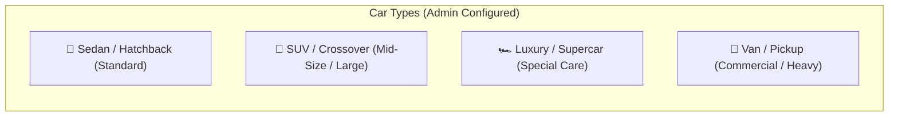
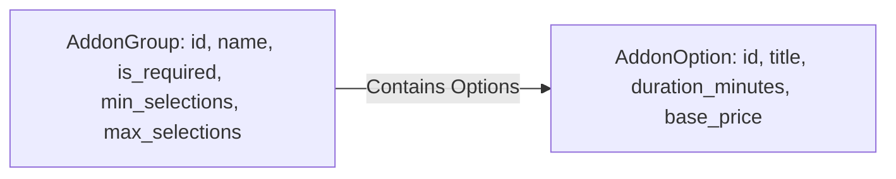

# Service Catalog & Pricing

800-CarWash operates a highly flexible, multi-dimensional catalog engine. Pricing is dynamically calculated based on the **Car Type classification**, the selected **Core Service**, and any **Add-ons**.

---

## 1. Car Type Categorization
Vehicles registered on the platform are categorized into standardized vehicle classes. Each class applies a specific pricing multiplier or base rate:

- **Sedan / Hatchback**: Standard vehicle dimension. Baseline pricing.
- **SUV / Crossover**: Requires additional water, cleaning agents, and duration (+20% to +35% over Sedan).
- **Luxury / Supercar**: Requires specialized micro-fiber handling, premium ph-neutral foam, and skilled detailing specialist (+50% to +100%).
- **Van / Pickup**: High surface area vehicle class.

---

## 2. Core Service Packages
Core services represent the base job packages available to customers:

| Service Package | Base Description | Est. Duration (Sedan) | Est. Duration (SUV) |
| :--- | :--- | :---: | :---: |
| **Exterior Express Wash** | Eco-friendly pressure wash, foam shampoo, rim blast, tire shine, exterior glass polish. | 25 mins | 35 mins |
| **Interior Deep Clean** | Vacuuming (seats, floor, trunk), dashboard wipe-down, AC vent dusting, glass clean. | 35 mins | 45 mins |
| **Signature Full Care (In & Out)** | Complete Exterior Express + Interior Deep Clean + Floor mat wash + Door jamb cleaning. | 50 mins | 65 mins |
| **Ceramic Detailing & Clay Bar** | Complete Full Care + Clay bar decontamination + Hydrophobic ceramic sealant coat. | 90 mins | 120 mins |

---

## 3. Add-on Groups & Validation Rules
Admin can create modular **Add-on Groups** and link them to one or more core services. Each group enforces strict UI and backend validation rules:

### Validation Rules Matrix:
1. **Single Choice (Radio)**: User can pick at most 1 item (e.g. *Fragrance Selection*: Lavender vs. Oud vs. Cool Breeze).
2. **Multiple Choice (Checkbox)**: User can pick $0$ to $N$ items up to `max_selections` (e.g. *Special Treatments*: Rim Wax, Engine Bay Clean, Leather Conditioner).
3. **Mandatory vs. Optional**: If `is_required = true`, the user cannot add the service to the cart without selecting at least `min_selections`.

---

## 4. Price Calculation Formula

For any vehicle item in an order:

$$\text{Item Total} = \text{BasePrice}(\text{Service}, \text{CarType}) + \sum_{k \in \text{Addons}} \text{AddonPrice}(k, \text{CarType})$$

### Calculation Example:
- **Vehicle**: Porsche Cayenne (**SUV**)
- **Core Service**: Signature Full Care (Base SUV Price = `95 AED`, Duration = `65 mins`)
- **Add-on 1**: Leather Conditioning (SUV Price = `35 AED`, Duration = `15 mins`)
- **Add-on 2**: Odor Elimination Ozone Shot (Price = `20 AED`, Duration = `10 mins`)
- **Total Item Cost**: $95 + 35 + 20 = \mathbf{150\text{ AED}}$
- **Total Execution Duration**: $65 + 15 + 10 = \mathbf{90\text{ mins}}$
