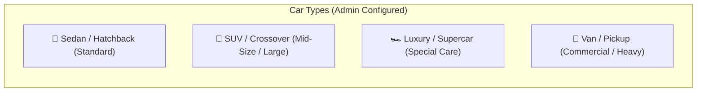
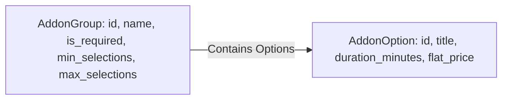

# Service Catalog & Pricing

800-CarWash operates a streamlined, intuitive catalog and pricing engine designed to keep ordering fast and frictionless for both single-car and multi-car customers:

- **Core Service Pricing**: Base service price **varies depending on the vehicle's Car Type** (e.g. Sedan vs SUV vs Luxury vs Van).
- **Add-on Pricing**: Add-on services have **universal flat rates regardless of vehicle type** (e.g. Tire Gel, Odor Elimination, Leather Conditioning).

---

## 1. Car Type Categorization
Vehicles registered on the platform are categorized into standardized vehicle classes. Core service pricing scales based on vehicle dimension and detailing effort:

- **Sedan / Hatchback**: Standard vehicle dimension. Baseline service pricing.
- **SUV / Crossover**: Requires additional water, cleaning agents, and duration (+20% to +35% over Sedan).
- **Luxury / Supercar**: Requires specialized micro-fiber handling, premium pH-neutral foam, and skilled detailing specialist (+50% to +100%).
- **Van / Pickup**: High surface area vehicle class.

---

## 2. Core Service Packages & Car Type Pricing Matrix
Core services represent the primary wash packages available to customers. Prices adjust automatically per car type:

| Service Package | Base Description | Sedan Price | SUV Price | Luxury / Van Price |
| :--- | :--- | :---: | :---: | :---: |
| **Exterior Express Wash** | Eco-friendly pressure wash, foam shampoo, rim blast, tire shine, exterior glass polish. | **45 AED** | **60 AED** | **85 AED** |
| **Interior Deep Clean** | Vacuuming (seats, floor, trunk), dashboard wipe-down, AC vent dusting, glass clean. | **55 AED** | **75 AED** | **100 AED** |
| **Signature Full Care (In & Out)** | Complete Exterior Express + Interior Deep Clean + Floor mat wash + Door jamb cleaning. | **85 AED** | **110 AED** | **150 AED** |
| **Ceramic Detailing & Clay Bar** | Complete Full Care + Clay bar decontamination + Hydrophobic ceramic sealant coat. | **160 AED** | **210 AED** | **290 AED** |

---

## 3. Flat-Rate Add-on Groups & Options
Add-ons enhance the selected core service and have **universal flat pricing** across all car types:

| Add-on Option | Category / Group | Flat Price (All Cars) | Est. Duration |
| :--- | :--- | :---: | :---: |
| **Tire Gel & Gloss Shine** | Exterior Add-ons | **15 AED** | +5 mins |
| **Windshield Rain-Repellent Coating** | Exterior Add-ons | **25 AED** | +10 mins |
| **Engine Bay Degreasing & Clean** | Exterior Add-ons | **35 AED** | +15 mins |
| **Leather Seat Conditioning Treatment**| Interior Add-ons | **30 AED** | +15 mins |
| **AC Vent Sanitization & Ozone Shot** | Interior Add-ons | **25 AED** | +10 mins |
| **Luxury Oud / Lavender Fragrance** | Scents & Finish | **10 AED** | +2 mins |

---

## 4. Simplified Price Calculation Formula

For each car item in an order:

$$\text{Car Item Total} = \text{ServicePrice}(\text{Service}, \text{CarType}) + \sum_{k \in \text{Selected Addons}} \text{FlatAddonPrice}(k)$$

$$\text{Master Order Total} = \sum_{i=1}^{N} \text{Car Item Total}_i - \text{Discount} + \text{Tip}$$

### Calculation Example:
- **Vehicle 1**: Porsche Cayenne (**SUV**)
  - Core Service: *Signature Full Care* = `110 AED`
  - Add-on: *Leather Conditioning* = `30 AED`
  - Item 1 Total = **140 AED** (65 mins)
- **Vehicle 2**: BMW 3 Series (**Sedan**)
  - Core Service: *Exterior Express Wash* = `45 AED`
  - Add-on: *Tire Gel Shine* = `15 AED`
  - Item 2 Total = **60 AED** (30 mins)
- **Total Master Order**: $140 + 60 = \mathbf{200\text{ AED}}$ (Total Duration: 95 mins)

