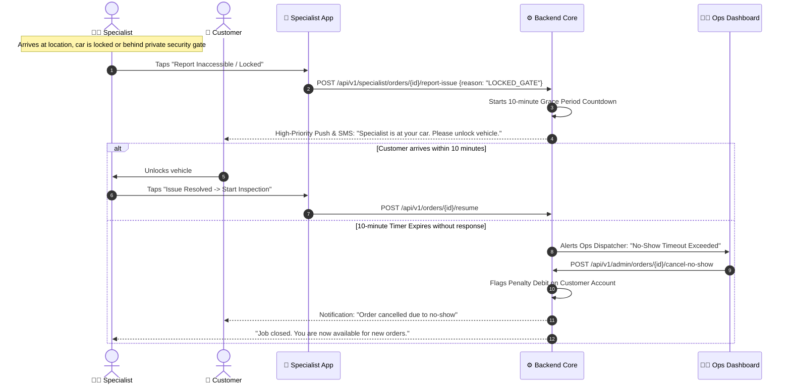
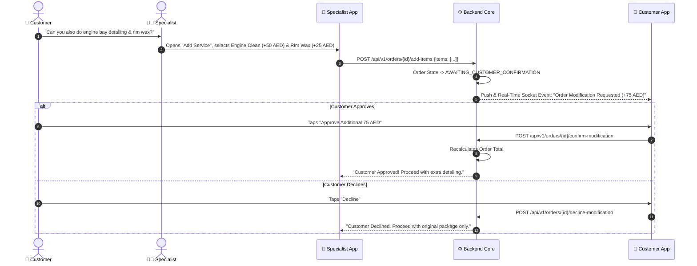

# Operational Exceptions & Penalty Matrix

In a mobile on-demand detailing operation, physical field anomalies (locked gates, inaccessible underground parking, vehicle breakdowns, customer delays) are standard occurrences. 

800-CarWash establishes deterministic protocols and system state transitions to handle these exceptions.

---

## 1. Exception Handling Matrix

| Operational Scenario | Initiated By | System Trigger / Action | Customer Impact | Specialist & Ops Action |
| :--- | :--- | :--- | :--- | :--- |
| **Pre-Journey Cancellation** | Customer | Order status $\rightarrow$ `CANCELLED_BY_CUSTOMER`. | Full cancellation. **0% Penalty**. | Specialist freed back to `AVAILABLE`. |
| **En-Route Cancellation** | Customer | Order status $\rightarrow$ `CANCELLED_WITH_PENALTY`. | **Cancellation Penalty Flag** recorded on user profile. | Specialist compensated for travel time; freed to `AVAILABLE`. |
| **Vehicle Inaccessible / Locked** | Specialist | Specialist taps "Vehicle Inaccessible / Customer Unreachable". | Automated 3-minute waiting timer + SMS/automated call trigger. | Specialist waits 10 minutes. If no access, Ops transitions to `CANCELLED_NO_SHOW`. |
| **Customer No-Show (Post 10m)** | Ops / Specialist | Order status $\rightarrow$ `CANCELLED_NO_SHOW`. | Penalty fee flagged against customer account. | Specialist departs; order closed. |
| **Technician Vehicle Breakdown** | Specialist | Specialist flags emergency: "Vehicle Issue". Order $\rightarrow$ `DISPATCH_ISSUE`. | Push notification offering immediate reassignment or reschedule. | Ops dashboard sounds audible alarm; 1-click reassignment to nearest technician. |
| **On-Site Service Upsell** | Customer / Specialist | Specialist adds line items $\rightarrow$ `AWAITING_CUSTOMER_CONFIRMATION`. | Real-time modal appears on customer app with price delta. | Specialist cannot start extra service until customer taps "Accept". |

---

## 2. Inaccessible Vehicle & No-Show Protocol Flow

---

## 3. On-Site Upselling Authorization Flow

