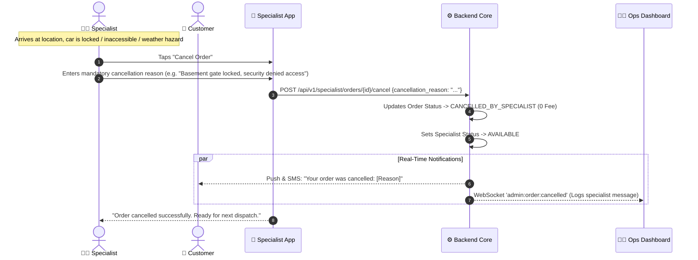
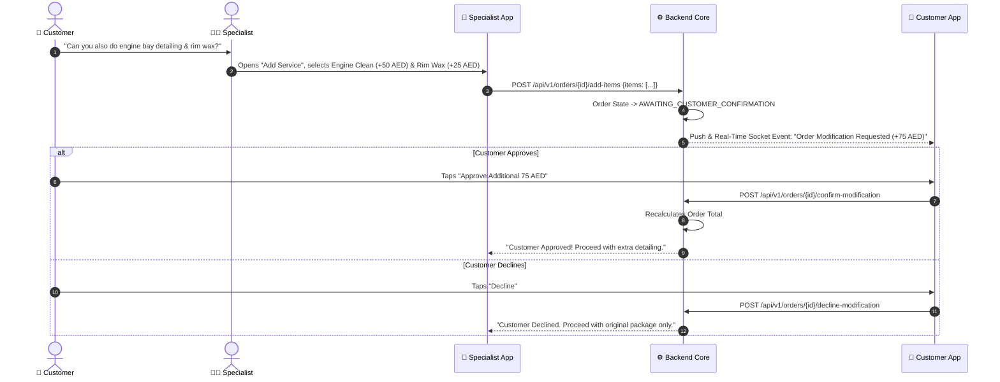

# Operational Exceptions & Specialist Cancellation Matrix

In a mobile on-demand detailing operation, physical field anomalies (locked gates, inaccessible underground parking, vehicle breakdowns, customer unreachable) are standard occurrences. 

800-CarWash establishes deterministic, zero-penalty protocols. If an order cannot proceed, the **specialist can cancel the order with a mandatory message** explaining the exact operational reason.

---

## 1. Exception Handling Matrix

| Operational Scenario | Initiated By | System Trigger / Action | Customer Impact | Specialist & Ops Action |
| :--- | :--- | :--- | :--- | :--- |
| **Specialist Cancellation (Field Obstacle)** | Specialist | `POST /api/v1/specialist/orders/{id}/cancel` with explanation message. | Order status $\rightarrow$ `CANCELLED_BY_SPECIALIST`. Push notification explaining reason. | **0% Penalty**. Specialist is immediately freed to `AVAILABLE`. Ops admin notified. |
| **Customer Cancellation** | Customer | Customer cancels order from app. | Order status $\rightarrow$ `CANCELLED_BY_CUSTOMER`. **0% Penalty**. | Specialist freed back to `AVAILABLE`. |
| **Vehicle Inaccessible / Locked** | Specialist | Specialist taps "Report Inaccessible / Unreachable". | Automated 10-minute waiting timer + SMS/Push notification sent to customer. | If customer does not appear, specialist cancels with explanation message. |
| **Technician Van Breakdown** | Specialist | Specialist flags emergency: "Equipment / Van Breakdown". | Order status $\rightarrow$ `DISPATCH_ISSUE`. Customer offered immediate reassignment or reschedule. | Ops dashboard receives audible alarm; 1-click reassignment to nearest specialist. |
| **On-Site Service Upsell** | Customer / Specialist | Specialist proposes extra treatment $\rightarrow$ `AWAITING_CUSTOMER_CONFIRMATION`. | Real-time modal appears on customer app with price delta. | Specialist cannot start extra service until customer taps "Accept". |

---

## 2. Specialist Order Cancellation Workflow

---

## 3. On-Site Upselling Authorization Flow

