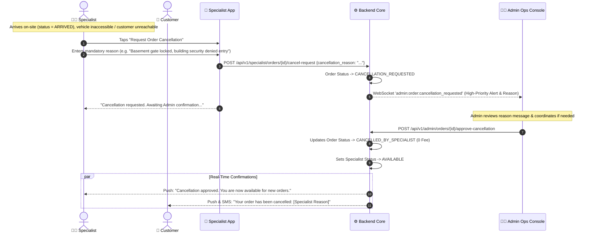
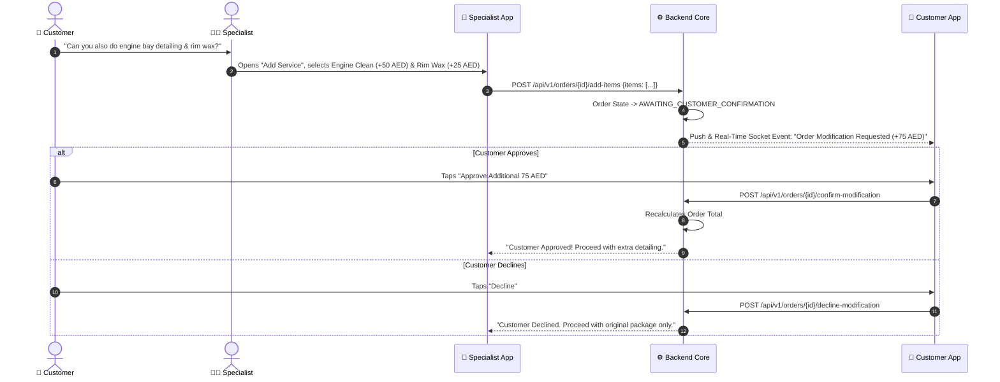

# Operational Exceptions & Specialist Cancellation Matrix

In a mobile on-demand detailing operation, physical field anomalies (locked gates, inaccessible underground parking, vehicle breakdowns, customer unreachable) are standard occurrences. 

800-CarWash establishes deterministic, zero-penalty protocols. If an order cannot proceed, the **specialist can cancel the order with a mandatory message** explaining the exact operational reason.

---

## 1. Exception Handling Matrix

| Operational Scenario | Initiated By | System Trigger / Action | Customer Impact | Specialist & Ops Action |
| :--- | :--- | :--- | :--- | :--- |
| **Specialist On-Site Cancellation Request** | Specialist (Only after `ARRIVED`) | `POST /api/v1/specialist/orders/{id}/cancel-request` with explanation message. | Order $\rightarrow$ `CANCELLATION_REQUESTED`. Customer notified of review. | **Admin receives instant alert & approves cancellation**. Upon approval, status $\rightarrow$ `CANCELLED_BY_SPECIALIST` (0% Fee) & specialist freed to `AVAILABLE`. |
| **Customer Cancellation** | Customer | Customer cancels order from app before service starts. | Order status $\rightarrow$ `CANCELLED_BY_CUSTOMER`. **0% Penalty**. | Specialist freed back to `AVAILABLE`. |
| **Vehicle Inaccessible / Locked** | Specialist (On-site) | Specialist taps "Report Inaccessible / Unreachable". | Automated 10-minute waiting timer + SMS/Push notification sent to customer. | If customer does not appear after 10 mins, specialist requests cancellation with message for Admin approval. |
| **Technician Van Breakdown** | Specialist | Specialist flags emergency: "Equipment / Van Breakdown". | Order status $\rightarrow$ `DISPATCH_ISSUE`. Customer offered immediate reassignment or reschedule. | Ops dashboard receives audible alarm; 1-click reassignment to nearest specialist. |
| **On-Site Service Upsell** | Customer / Specialist | Specialist proposes extra treatment $\rightarrow$ `AWAITING_CUSTOMER_CONFIRMATION`. | Real-time modal appears on customer app with price delta. | Specialist cannot start extra service until customer taps "Accept". |

> [!IMPORTANT]
> **Arrival & Admin Approval Prerequisite**: 
> 1. Specialists **cannot** request cancellation while in `ASSIGNED`, `ACKNOWLEDGED`, or `EN_ROUTE` states. The request action is only unlocked **after tapping "I Have Arrived"** (`status = ARRIVED`).
> 2. Specialist cancellation is **never instant** — it submits a cancellation request with reason message to the Admin Ops Console.
> 3. Admin Ops reviews the reason and clicks **"Approve Cancellation"**, transitioning the order to `CANCELLED_BY_SPECIALIST` and freeing the specialist back to `AVAILABLE`.

---

## 2. Specialist Cancellation & Admin Approval Workflow

---

## 3. On-Site Upselling Authorization Flow

