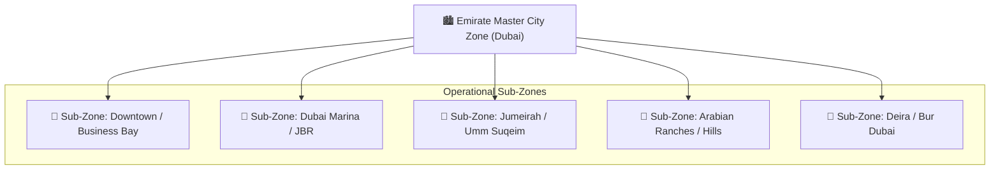
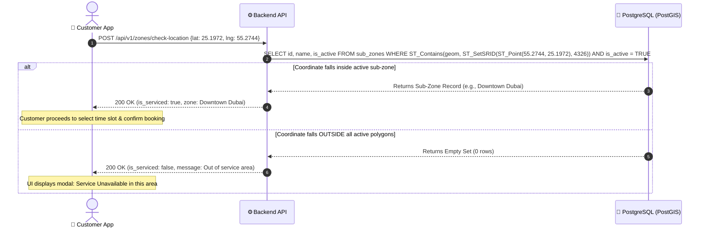

# Service Zones & Geofencing

800-CarWash operates on a strict spatial bounding architecture powered by **PostGIS**. Service availability, team allocation, and scheduling capacities are partitioned geographically.

---

## 1. Geographic Boundary Architecture

The platform models service areas in a two-tier spatial hierarchy:

---

## 2. Spatial Geofencing Logic

When a user selects or drops a pin on the map picker in the Customer Mobile App, the latitude and longitude coordinates $(\text{Lat}, \text{Lng})$ are transmitted to the backend for an immediate Point-in-Polygon (PIP) evaluation.

---

## 3. Strict Out-of-Service Area Policy
- **Zero Booking Leakage**: If a customer selects a location outside Dubai's active polygon boundaries, the application **strictly blocks** the checkout flow.
- **Visual Feedback**: The map boundary is visually represented with an outline, and an alert banner informs the user: *"We do not service this location yet. Please select an address within our Dubai service zones."*

---

## 4. Sub-Zone Management & Fleet Clustering
Each sub-zone is an independent operational unit that governs:
1. **Specialist Team Allocation**: Specialists can be assigned to a primary sub-zone base to minimize travel times and traffic delays across Dubai.
2. **Hourly Capacity Limits**: Admin defines maximum concurrent bookings per time slot (e.g. max 5 simultaneous washes in *Dubai Marina* between 10:00–11:00 AM).
3. **Dynamic On-Demand Dispatch**: On-demand dispatch searches for specialists stationed or currently active within the specific sub-zone.
