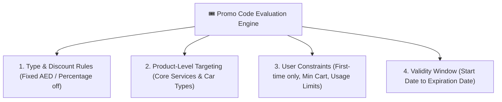
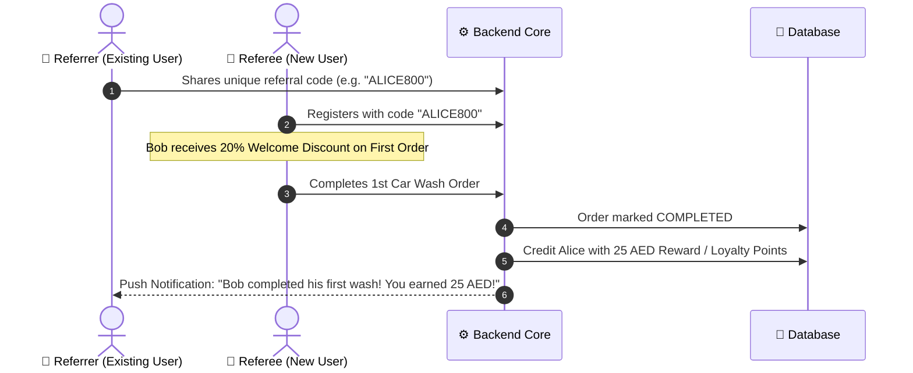

# Growth & Retention Engine

800-CarWash integrates a comprehensive marketing and customer retention suite directly into the core transactional engine.

---

## 1. Promo Code Engine

The promo code system provides granular targeting and redemption validation:

### Discount Computation Logic:
- If `type = FIXED`:
  $$\text{Discount} = \min(\text{fixed\_amount}, \text{EligibleCartTotal})$$
- If `type = PERCENTAGE`:
  $$\text{Discount} = \min\left( \text{EligibleCartTotal} \times \frac{\text{percent}}{100}, \text{max\_discount\_cap} \right)$$

---

## 2. Multi-Car Tiered Order Incentive

To drive higher Average Order Value (AOV) and capitalize on residential villas in Dubai where families own multiple vehicles, the system applies an automatic multi-car discount without needing a coupon code:

| Vehicle Position | Applicable Base Discount | Rationale |
| :--- | :---: | :--- |
| **1st Vehicle** | **0% (Standard Rate)** | Standard dispatch & travel costs amortized. |
| **2nd Vehicle** | **15% Off Base Service** | Zero extra specialist travel or fuel overhead. |
| **3rd+ Vehicle** | **20% Off Base Service** | Maximum labor utilization on a single site. |

---

## 3. Loyalty Points System

Designed to incentivize repeat bookings and increase customer lifetime value (LTV):

1. **Point Accrual**:
    - Admin configures the accrual rule (e.g., `1 AED spent = 1 Loyalty Point`).
    - Points are awarded automatically upon order status reaching `COMPLETED`.
2. **Point Redemption**:
    - Admin defines the redemption conversion rate (e.g., `100 Points = 10 AED credit`).
    - Customers can apply their available point balance during checkout to reduce the payable total.
3. **Ledger Integrity**:
    - All point transactions (Credit, Debit, Expiry) are recorded immutably in the `loyalty_transactions` ledger.

---

## 4. Referral Program (Two-Sided Incentive)

A viral customer acquisition loop built into the mobile app:

---

## 4. Staff Tipping Module

Technician motivation and service excellence are reinforced via direct customer tipping:
- **Tipping Prompt**: Triggered immediately during the post-wash 1–5 star rating screen.
- **Predefined Amounts**: Fast 1-tap options (e.g., `5 AED`, `10 AED`, `20 AED`, or `Custom`).
- **100% Specialist Attribution**: Every dirham tipped is attributed directly to the assigned detailing specialist.
- **Settlement**: Tips are logged in the technician's balance ledger for bi-weekly/monthly payroll payouts.
