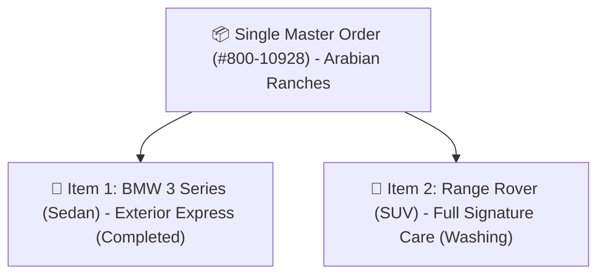
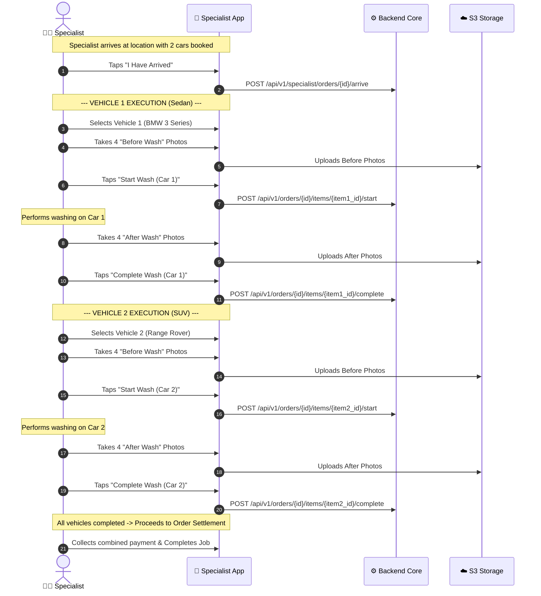

# Multi-Car Order Architecture

A flagship capability of 800-CarWash is the ability for a customer to book washes for **multiple vehicles at the same location within a single order checkout**.

---

## 1. Multi-Car Order Principles

In residential villas, family compounds, and workplace parking lots across Dubai, customers often own more than one vehicle (e.g. 1 Sedan and 1 SUV).

### Key Business Rules:
1. **Heterogeneous Vehicle Configurations**:
    - Different car types have different baseline prices.
    - Each vehicle can have completely different core services and add-on selections.
2. **Sequential Field Execution**:
    - A single assigned specialist washes the vehicles **one by one in sequence**.
    - Total estimated service time is the cumulative sum of all vehicles' durations:
      $$\text{Total Duration} = \sum_{i=1}^{N} \left( \text{Duration}(\text{Service}_i) + \sum \text{Duration}(\text{Addon}_{i, j}) \right)$$
3. **Independent Photo Quality Gates**:
    - The specialist must capture and upload 2–4 "Before" and 2–4 "After" photos **for each individual vehicle**.
    - Vehicle 1 cannot be marked finished without its photos; Vehicle 2 must have its own separate photo set.

---

## 2. Multi-Car Specialist Execution Flow

---

## 3. Customer UI Experience
- The Customer Mobile App features an interactive **"Add Another Vehicle"** button in the booking cart.
- Real-time progress indicators show:
  - `Car 1 (BMW): Completed ✅`
  - `Car 2 (Range Rover): In Progress (Washing) ⏳`
- Customers can preview the clean inspection photos for each car directly in the app.
