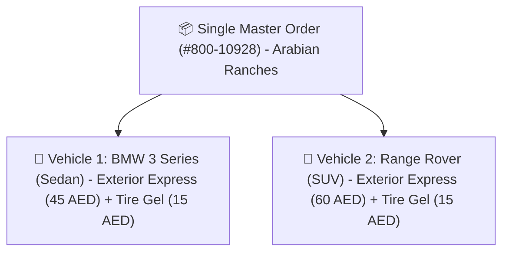
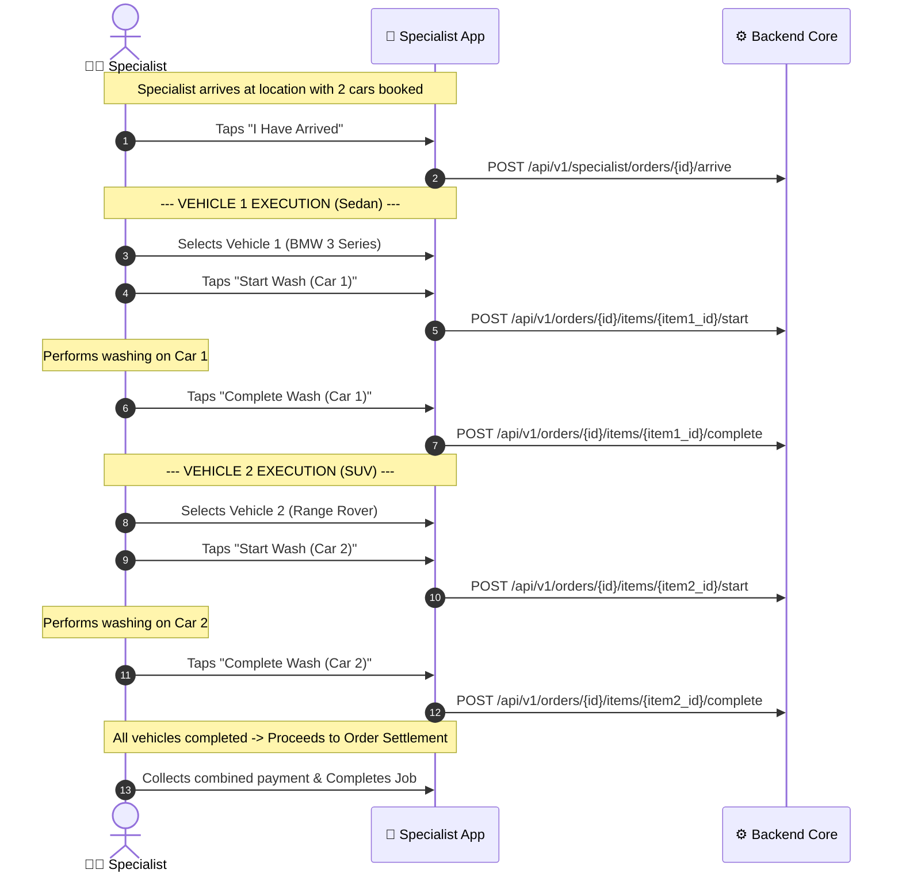
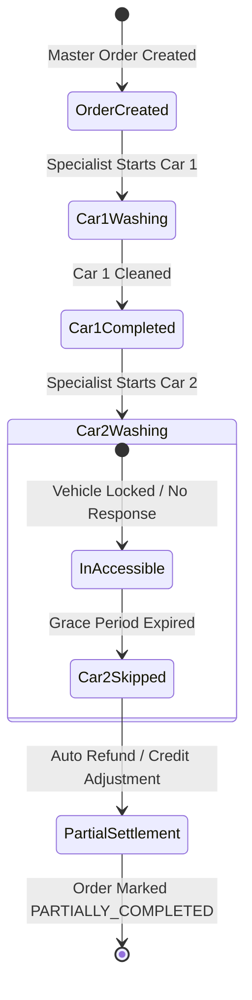

# Multi-Car Order Architecture

A flagship capability of 800-CarWash is the ability for a customer to book washes for **multiple vehicles at the same location within a single order checkout**.

---

## 1. Multi-Car Order Principles

In residential villas, family compounds, and workplace parking lots across Dubai, customers frequently book services for **more than one vehicle at the same location** in a single checkout.

### Simplified Customer Journey:
1. **Choose Service**: Customer selects the desired main package (e.g. *Exterior Express Wash*).
2. **Select Vehicle(s)**: Customer checks off the cars to be washed (e.g. *Sedan* and *SUV*). The service price adjusts automatically per vehicle type.
3. **Choose Add-ons**: Customer selects optional enhancements (e.g. *Tire Gel Shine*, *AC Ozone Shot*). All add-ons carry a **universal flat rate** regardless of car type.
4. **Order Creation**: A single master order with individual vehicle items is created.

### Key Operational Rules:
1. **Sequential Field Execution**:
   - A single assigned specialist washes the vehicles **one by one in sequence**.
   - Total service time is calculated cumulatively:
     $$\text{Total Duration} = \sum_{i=1}^{N} \left( \text{Duration}(\text{Service}_i, \text{CarType}_i) + \sum \text{Duration}(\text{Addon}_j) \right)$$
2. **Sequential Multi-Car Execution**:
   - Vehicles are detailed sequentially with dedicated start/complete markers per vehicle item.
3. **Targeted Coupons & Promotions**:
   - Multi-car incentives are managed flexibly through targeted Admin Promo Codes (e.g. `MULTICAR15` or `FAMILY20`) rather than rigid automatic pricing overrides.

---

## 2. Multi-Car Specialist Execution Flow

---

## 4. Multi-Car Partial Failure Sagas & Status Lifecycle

In real-world multi-car bookings, unforeseen operational exceptions can affect one vehicle without invalidating the others (e.g. Car 1 is washed, but Car 2 is locked in a private garage or blocked by construction).

### Discrete Item-Level Status Transitions:
Each `order_item` maintains an independent state:
$$\text{PENDING} \longrightarrow \text{IN\_PROGRESS} \longrightarrow \begin{cases} \text{COMPLETED} \\ \text{SKIPPED (Customer Requested)} \\ \text{ACCESS\_FAILED (Locked/Blocked)} \end{cases}$$

### Compensation & Settlement Rules:
1. **Dynamic Master Order Status**:
   - All items `COMPLETED` $\rightarrow$ Order is `COMPLETED`.
   - Some items `COMPLETED` and others `SKIPPED` $\rightarrow$ Order transitions to `PARTIALLY_COMPLETED`.
2. **Automated Refund & Balance Adjustment**:
   - If an item is marked `SKIPPED` or `ACCESS_FAILED`, the billing engine recalculates the subtotal.
   - For online payments, a BullMQ job issues a partial refund for the skipped item and its specific add-ons within 24 hours.
   - For Cash on Delivery (COD), the specialist app displays the adjusted total collection amount.

