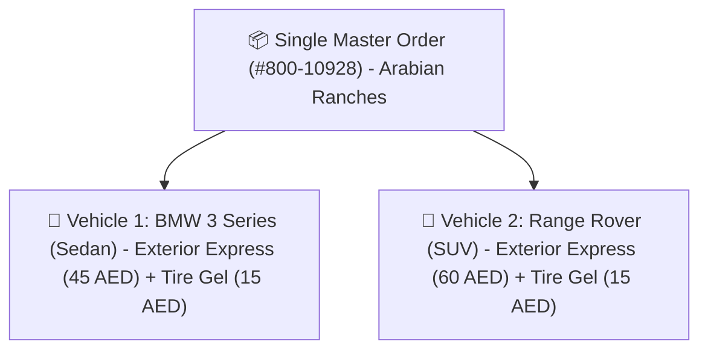
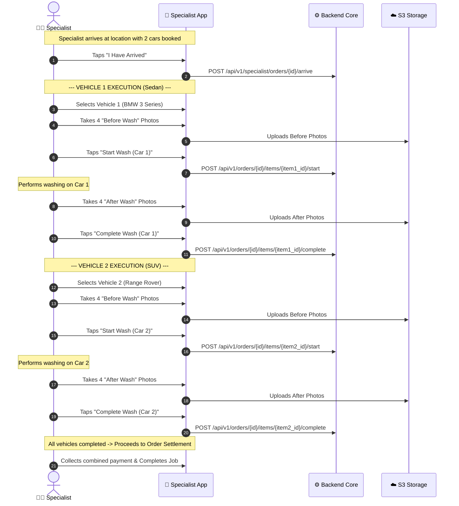

# Multi-Car Order Architecture

A flagship capability of 800-CarWash is the ability for a customer to book washes for **multiple vehicles at the same location within a single order checkout**.

---

## 1. Multi-Car Order Principles

In residential villas, family compounds, and workplace parking lots across Dubai, customers frequently book services for **more than one vehicle at the same location** in a single checkout.

### Simplified Customer Journey:
1. **Choose Service**: Customer selects the desired main package (e.g. *Exterior Express Wash*).
2. **Select Vehicle(s)**: Customer checks off the cars to be washed (e.g. *Sedan* and *SUV*). The service price adjusts automatically per vehicle type.
3. **Choose Add-ons**: Customer selects optional enhancements (e.g. *Tire Gel Shine*, *AC Ozone Shot*). All add-ons carry a **universal flat rate** regardless of car type.
4. **Order Creation**: A single master order with individual vehicle items is created.

### Key Operational Rules:
1. **Sequential Field Execution**:
   - A single assigned specialist washes the vehicles **one by one in sequence**.
   - Total service time is calculated cumulatively:
     $$\text{Total Duration} = \sum_{i=1}^{N} \left( \text{Duration}(\text{Service}_i, \text{CarType}_i) + \sum \text{Duration}(\text{Addon}_j) \right)$$
2. **Per-Vehicle Inspection Quality Gates**:
   - The specialist must capture 2–4 "Before" and 2–4 "After" photos **for each individual vehicle item**.
   - Vehicle 1 cannot be marked finished without its photos; Vehicle 2 must have its own separate photo set.

---

## 2. Multi-Car Specialist Execution Flow

---

## 3. Customer UI Experience
- The Customer Mobile App features an interactive **"Add Another Vehicle"** button in the booking cart.
- Real-time progress indicators show:
  - `Car 1 (BMW): Completed ✅`
  - `Car 2 (Range Rover): In Progress (Washing) ⏳`
- Customers can preview the clean inspection photos for each car directly in the app.
