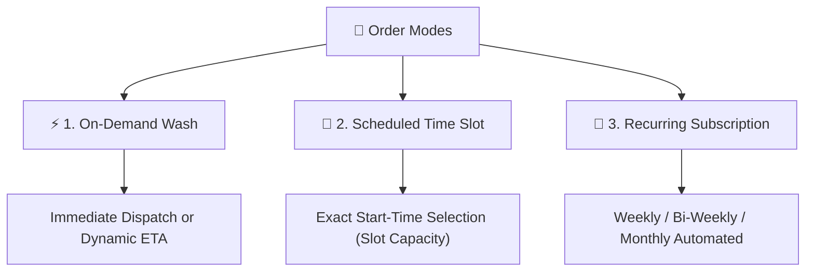
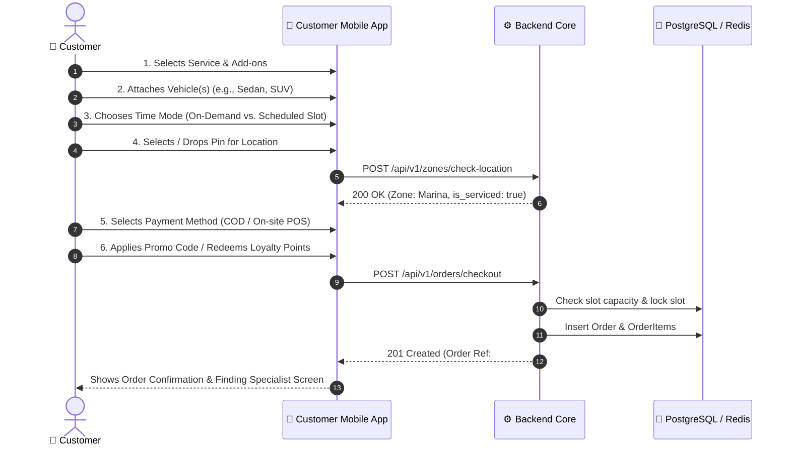
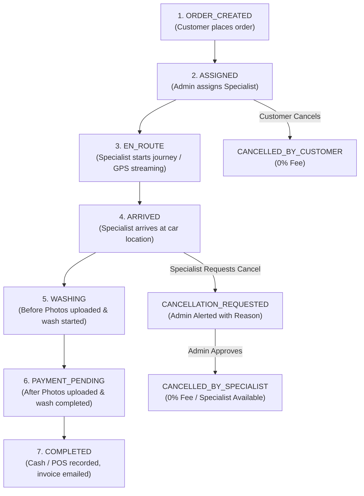

# Ordering & Scheduling Engine

800-CarWash provides three distinct ordering mechanisms to cater to both immediate and planned detailing needs.

---

## 1. The Three Order Fulfillment Modes

---

## 2. On-Demand Booking Flow

On-Demand orders are designed for instant doorstep fulfillment:

1. **Specialist Availability Check**:
    - If specialists in the sub-zone are in `AVAILABLE` state, the order displays an estimated arrival time of **20–30 minutes**.
    - If all specialists in the zone are currently `WASHING` or `EN_ROUTE`, the system calculates a dynamic ETA based on when the earliest job completes + travel time (e.g. ~45–60 mins).
2. **Order Placement**: Order transitions immediately to `ORDER_CREATED` $\rightarrow$ `ASSIGNING_SPECIALIST`.
3. **Dispatch Notification**: Admin Ops team receives an alert to assign the order directly to a specialist.

---

## 3. Scheduled Start-Time Slots

Scheduled bookings allow customers to plan ahead with precision:

- **Slot Granularity**: Configured by Admin with exact start times (e.g., `08:00 AM`, `09:00 AM`, `10:00 AM`, ..., `08:00 PM`).
- **Slot Capacity Management**:
    - Each sub-zone has an Admin-configured capacity per slot (e.g., `capacity = 4`).
    - When 4 bookings are confirmed for `10:00 AM` in *Downtown Dubai*, that specific slot is marked `SOLD_OUT` and disabled in the customer app.
- **Booking Window**: Customers can schedule up to 7 days in advance.

---

## 4. End-to-End Customer Booking Sequence

---

## 5. Order State Lifecycle

