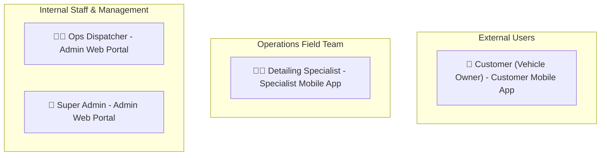

# User Personas & Roles

The 800-CarWash platform manages four primary stakeholder personas, each governed by role-based access control (RBAC) and tailored user interfaces.

---

## Stakeholder Overview

---

## 1. Customer (Vehicle Owner)
- **Primary Interface**: Customer Mobile App (iOS / Android).
- **Authentication**: Phone Number + SMS OTP.
- **Key Goals**:
    - Easily schedule a car wash without making phone calls or waiting in queues.
    - Save multiple home and work parking locations with exact floor/spot instructions.
    - Book individual or multiple cars in a single session with distinct detailing options.
    - Track the incoming specialist's vehicle with live ETA.
    - Review before/after photos of the clean vehicle.
    - Tip the specialist and earn loyalty points for repeat usage.

---

## 2. Detailing Specialist (Team Member)
- **Primary Interface**: Specialist Mobile App (iOS / Android).
- **Authentication**: Admin-issued credentials (username/email + password).
- **Key Goals**:
    - Receive immediate job assignments dispatched by the operations team.
    - Navigate directly to the vehicle using Google Maps / Waze deep links with parking notes.
    - Update work status (`EN_ROUTE`, `ARRIVED`, `WASHING`, `COMPLETED`).
    - Capture 2–4 mandatory "Before" and "After" inspection photos per vehicle.
    - Add on-site service add-ons if requested by the customer in person.
    - Record payment collection (Cash or Mobile POS Card).
    - Manage shift status (Active, Break, Sick, Offline).

---

## 3. Operations Dispatcher (Ops Admin)
- **Primary Interface**: Admin Operations Web Portal.
- **Authentication**: Corporate Email + Strong Password + 2FA.
- **Key Goals**:
    - Monitor the live Dubai map showing all active specialists and incoming orders.
    - Assign pending on-demand and scheduled orders directly to available specialists.
    - Reassign orders in case of emergency or technician vehicle breakdown.
    - Manage customer inquiries and manual order modifications.
    - Review flagged no-shows or inaccessible parking situations.

---

## 4. Super Admin / Executive Management
- **Primary Interface**: Admin Operations Web Portal.
- **Authentication**: Enterprise Super Admin Credentials.
- **Key Goals**:
    - Define and configure service areas, sub-zones, and geofence boundaries.
    - Manage car brands, models, and car type categorizations.
    - Configure service packages, add-on groups, and vehicle-type pricing matrices.
    - Set hourly slot capacities and operating hours per sub-zone.
    - Launch and monitor promotional campaigns, loyalty rates, and referral bonuses.
    - Access financial analytics, revenue reports, and technician payroll/tip reconciliations.

---

## Role-Based Access Control (RBAC) Matrix

| Resource / Capability | Customer | Specialist | Ops Dispatcher | Super Admin |
| :--- | :---: | :---: | :---: | :---: |
| **Book / Cancel Own Order** | ✅ | ❌ | ✅ | ✅ |
| **View Own Cars & Locations** | ✅ | ❌ | ✅ (View) | ✅ |
| **Stream Background GPS** | ❌ | ✅ | ❌ | ❌ |
| **Upload Inspection Photos** | ❌ | ✅ | ✅ (Override) | ✅ |
| **Direct Dispatch Orders** | ❌ | ❌ | ✅ | ✅ |
| **Edit Geofence Polygons** | ❌ | ❌ | ❌ | ✅ |
| **Configure Catalog & Pricing** | ❌ | ❌ | ❌ | ✅ |
| **Create Promo Codes & Loyalty** | ❌ | ❌ | ❌ | ✅ |
| **Manage Staff Credentials** | ❌ | ❌ | ❌ | ✅ |
| **View Financial Reports** | ❌ | ❌ | ❌ | ✅ |
