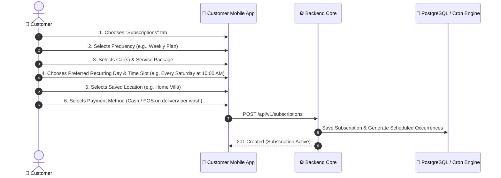
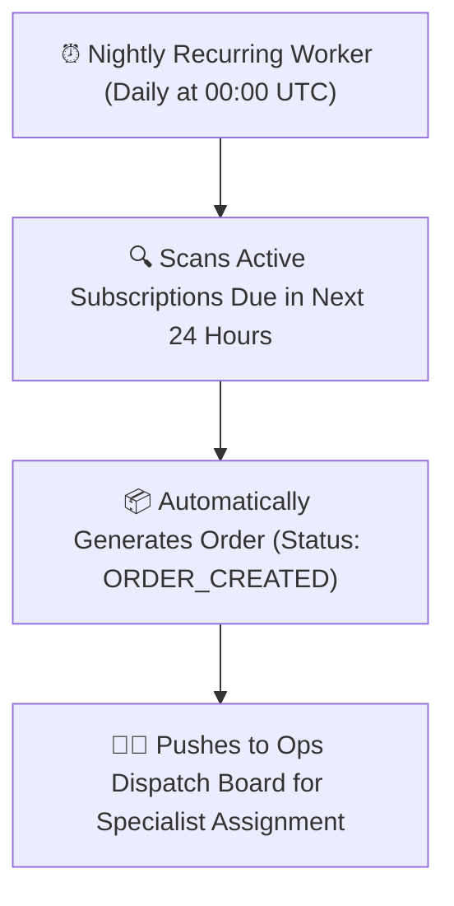

# Subscriptions Module

The 800-CarWash subscription engine delivers predictable recurring revenue by enabling customers to automate their vehicle cleaning routines.

---

## 1. Subscription Frequencies & Packages

Admin can create and publish customizable subscription packages:

| Frequency | Target Customer Use Case | Typical Billing Cycle | Discount Tier |
| :--- | :--- | :--- | :---: |
| **Weekly Care** | Daily commuters, luxury car owners, executives | Billed every 4 weeks (4 washes) | 20% Off Standard Rates |
| **Bi-Weekly Care** | Standard family vehicles, weekend drivers | Billed every 4 weeks (2 washes) | 15% Off Standard Rates |
| **Monthly Routine** | Low-mileage vehicles, occasional drivers | Billed monthly (1 wash) | 10% Off Standard Rates |

---

## 2. Subscription Configuration Workflow

---

## 3. Automated Order Generation Lifecycle

The platform uses a background scheduler (BullMQ cron worker) to instantiate live orders ahead of time:

---

## 4. Subscription Management Features
- **Pause & Resume**: Customer can pause their recurring schedule during vacations or travel periods.
- **Skip Wash**: Customer can skip an upcoming scheduled session at least 12 hours prior without penalty.
- **Location / Slot Change**: Customer can modify their recurring delivery window or parking spot via the app.
