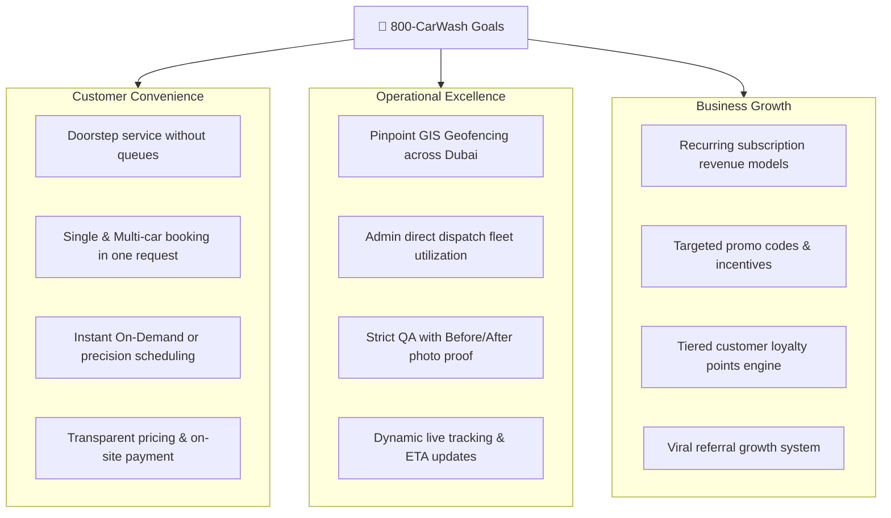

# Vision & Business Scope

## 1. Vision Statement
**800-CarWash** is designed to transform the mobile vehicle care industry across the United Arab Emirates by delivering an on-demand, hyper-convenient, and technologically seamless car detailing service right to the customer's doorstep, parking bay, or villa.

---

## 2. Core Business Objectives

---

## 3. Scope of the v1 Platform

### In-Scope (Phase 1)
1. **Service Coverage**: Dubai metropolitan area, partitioned into administrative and operational sub-zones (Downtown, Dubai Marina, Business Bay, Jumeirah, Arabian Ranches, etc.).
2. **Order Execution Types**:
    - **On-Demand**: Immediate dispatch (if a specialist is available) or dynamic ETA (~30–45 mins).
    - **Scheduled Slots**: Precision start-time booking (e.g. 10:00 AM, 11:00 AM) governed by slot capacity limits per sub-zone.
    - **Recurring Subscriptions**: Configurable weekly, bi-weekly, or monthly automated washing routines.
3. **Vehicle & Multi-Car Management**:
    - Customer profiles holding multiple vehicles (Brand, Model, Emirate, Plate Code, Plate Number, Color, Vehicle Type).
    - Multi-car single orders: Booking multiple vehicles with separate service and add-on selections in one dispatch.
4. **Operations & Quality Assurance**:
    - Centralized Admin Web dispatch dashboard for manual specialist assignment.
    - Specialist mobile app with live GPS tracking, in-app turn-by-turn guidance, and mandatory 2–4 Before & After photos per car.
    - On-site add-on upselling with real-time customer app confirmation.
5. **Growth & Commercial Core**:
    - Promo codes (Fixed AED / Percentage off, product targeting, first-time user controls).
    - Loyalty points engine (earning and redeeming on future orders).
    - Referral rewards (give 20% welcome discount, get 25 AED credit).
    - 100% Specialist tipping during post-wash rating.
6. **Payment Methods**: Cash on Delivery (COD) and On-site Card via Mobile POS terminal.

### Future Roadmap (Phase 2+)
- Automated intelligent dispatch algorithm (auto-assignment based on proximity, battery/water levels, and AI routing).
- Online Payment Gateway (Stripe / Checkout.com / Apple Pay / Google Pay / Tabby Buy-Now-Pay-Later).
- Expansion beyond Dubai to Abu Dhabi, Sharjah, and GCC territories.
- Corporate fleet management and B2B parking facility contracts.
