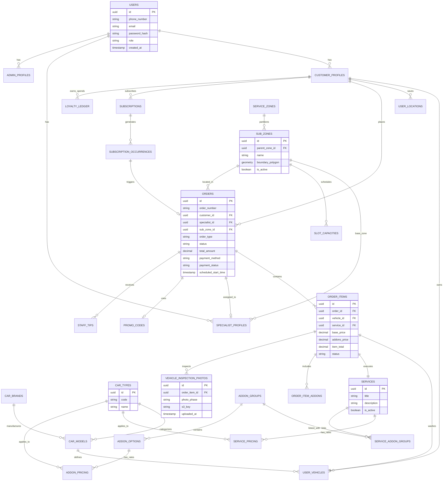

# Comprehensive Database ERD

The 800-CarWash persistence tier is designed with relational rigor and spatial PostGIS extensions in **PostgreSQL 17+**.

---

## 1. Entity-Relationship Diagram (ERD)

---

## 2. Relational Design Rationale

1. **Normalized Multi-Vehicle Schema (`ORDERS` $\rightarrow$ `ORDER_ITEMS`)**:
   - Isolating each vehicle into its own `ORDER_ITEMS` row guarantees individual status tracking, independent add-on attachments, and separate Before/After photo collections.
2. **PostGIS Native Geometries**:
   - `SUB_ZONES.boundary_polygon` uses `geometry(Polygon, 4326)` with a spatial **GIST index** for instant spatial joins and Point-in-Polygon validation.
3. **Price Matrices Isolation**:
   - `SERVICE_PRICING` and `ADDON_PRICING` decouple price definitions from the core service catalog, enabling vehicle-type specific rate configurations without duplicating service records.
