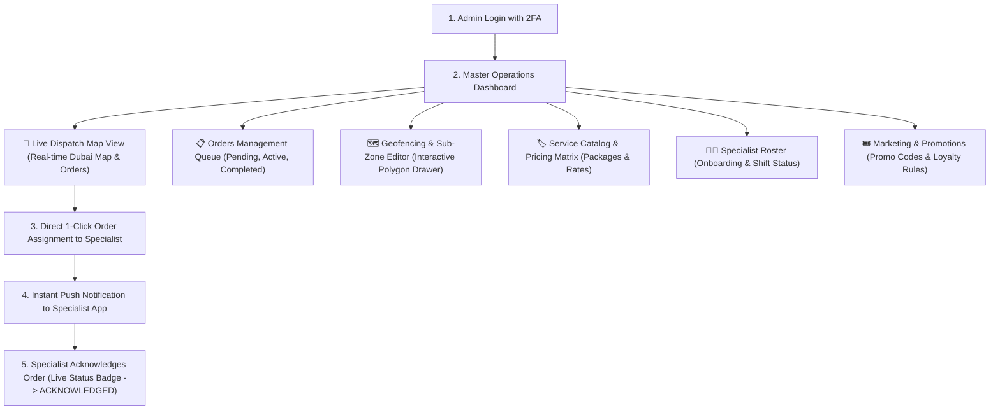

# Admin Web Portal User Flow

This document outlines the workflow and UI structure of the **Admin Operations Web Portal (Next.js 16 / React 19 / Tailwind / Shadcn UI)**.

---

## 1. Operations & Dispatch Workflow

---

## 2. Key Administrative Interfaces

### 1. Live Dispatch Map Console
- **Interactive Map**: Built with high-performance vector tiles displaying all active sub-zones in Dubai.
- **Specialist Markers**: Color-coded pins indicating current status:
  - 🟢 **Green**: `AVAILABLE`
  - 🔵 **Blue**: `EN_ROUTE`
  - 🟠 **Orange**: `WASHING`
  - ⚫ **Gray**: `OFFLINE / SICK / BREAK`
- **1-Click Dispatch**: Clicking an unassigned order card immediately highlights the closest available specialists within that sub-zone for instantaneous manual assignment.

### 2. Geofence & Sub-Zone Polygon Editor
- Allows Ops managers to visually draw, edit, and fine-tune polygon coordinates for new communities and sub-zones across the UAE.
- Exports validated GeoJSON directly to the PostGIS spatial database.

### 3. Service & Pricing Matrix Table
- A multi-tier grid allowing admins to set independent prices per vehicle category (Sedan, SUV, Luxury, Van) for both core packages and add-on treatments.
