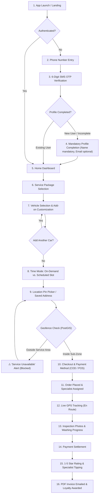

# Customer Mobile App User Flow

This document details the end-to-end user experience and screen progression within the **Customer Mobile App (React Native)**.

---

## 1. Complete Customer Journey Map

---

## 2. Key Screen Breakdown

### Screen 1: Home & Garage
- View registered vehicles (e.g. `Porsche Cayenne GTS - Dubai A 80021`).
- Quick-action buttons: **Book Wash**, **Active Subscriptions**, **Loyalty Balance**.

### Screen 2: Multi-Car Configuration Sheet
- Step 1: Pick Service (e.g. *Signature In & Out*).
- Step 2: Configure Add-ons (e.g. *Leather Conditioner*, *Oud Fragrance*).
- Step 3: Assign to Car 1.
- Step 4: Tap `+ Add Another Vehicle` $\rightarrow$ Repeat for Car 2.

### Screen 3: Live Journey & Washing Screen
- Live Map rendering Specialist vehicle pin with smooth interpolation.
- Vehicle Inspection Gallery: Expandable Before & After photos captured by the technician.
- Real-time notification if specialist requests an on-site add-on.
