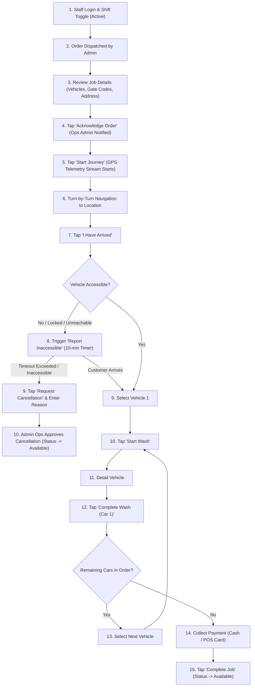

# Specialist Mobile App User Flow

This document details the operational workflow, inspection gates, and field interactions within the **Specialist Mobile App (React Native)**.

---

## 1. Specialist Field Execution Flow

---

## 2. Streamlined Service Execution

The specialist workflow prioritizes speed and operational simplicity:

1. **Instant Wash Activation**: Specialist selects the vehicle and taps **"Start Wash"** to begin detailing without photo blockers.
2. **Optional Pre-Existing Damage Flag**: If a technician spots a deep scratch, cracked windshield, or dent before beginning work, they can tap an optional **"Quick Damage Note"** to snap a 3-second photo. This immediately protects the business from false liability claims without blocking the order flow.
3. **Offline-First Basement Mode**: In underground parking structures (P1–B4) with zero network coverage, wash state transitions are saved in the app's local encrypted SQLite database and automatically flushed to the server when network connectivity is restored.
4. **Wash Completion**: Once finished, tapping **"Complete Wash"** advances the car to completed state.
5. **Future Roadmap**: Mandatory multi-angle inspection photo gates remain scheduled for a future version release.
