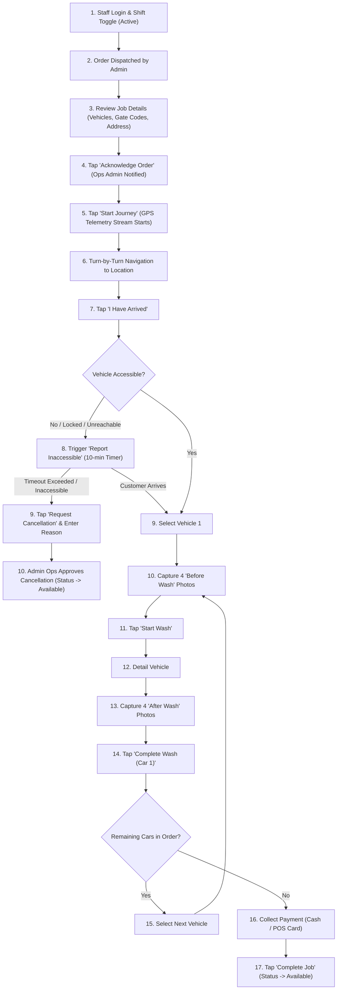

# Specialist Mobile App User Flow

This document details the operational workflow, inspection gates, and field interactions within the **Specialist Mobile App (React Native)**.

---

## 1. Specialist Field Execution Flow

---

## 2. Mandatory Inspection Photo Gate

The mobile application enforces strict software validation:

1. The **"Start Wash"** button remains disabled until 4 distinct "Before Wash" photos are captured and confirmed uploaded to S3.
2. The **"Complete Wash"** button remains disabled until 4 corresponding "After Wash" photos are captured and verified.
3. If pre-existing scratch or paint damage is identified, the specialist can take a flagged **"Damage Note"** photo to protect the platform from liability.
