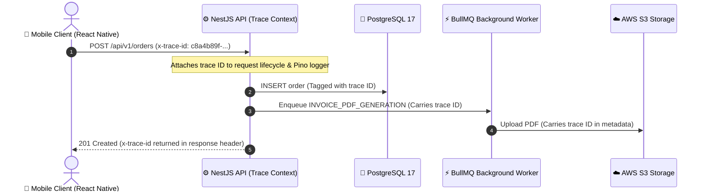

# Audit Logging & Observability

To maintain operational integrity, troubleshoot dispatch exceptions, and ensure security compliance, 800-CarWash incorporates comprehensive audit trails and system observability.

---

## 1. Structured Audit Logging

Every critical business action is logged into an immutable `audit_logs` table and streamed to centralized logging (e.g. Datadog / Grafana Loki / AWS CloudWatch):

```json
{
  "timestamp": "2026-08-15T18:32:10.450Z",
  "action": "ORDER_DISPATCHED",
  "actor": {
    "user_id": "9b1a2c3d-4e5f-6a7b-8c9d-0e1f2a3b4c5d",
    "role": "OPS_ADMIN",
    "email": "ops.lead@800carwash.ae",
    "ip_address": "86.96.12.44"
  },
  "target": {
    "resource": "ORDER",
    "order_id": "8f3b2c1a-5d4e-4f6a-9b8c-1e2d3f4a5b6c",
    "order_number": "800-240815-092"
  },
  "changes": {
    "assigned_specialist_id": {
      "old": null,
      "new": "7a1b2c3d-4e5f-6a7b-8c9d-0e1f2a3b4c5d"
    },
    "status": {
      "old": "ORDER_CREATED",
      "new": "ASSIGNED"
    }
  }
}
```

---

## 2. Monitored Operational Actions
- **Dispatch Actions**: Order assigned, reassigned, or cancelled by Admin.
- **Geofence Modifications**: Polygon updates, sub-zone status toggles.
- **Financial Adjustments**: Promo code creation, loyalty point balance manual modifications.
- **Quality Gates**: Overriding missing inspection photos or cancelling no-shows.

---

## 3. Distributed Tracing & Telemetry (OpenTelemetry)

To trace request execution paths across mobile clients, API gateways, database transactions, and background workers, every interaction is tagged with standard trace headers:

- **Trace ID Propagation**: All HTTP headers and WebSocket messages carry `x-trace-id` (UUIDv7) and `x-correlation-id`.
- **Trace Context**: Propagated through NestJS middlewares, BullMQ queue jobs, and external HTTP client calls.



---

## 4. Structured JSON Logging Format (Pino)

All application logs are formatted as single-line JSON strings to facilitate ingestion into Datadog, Grafana Loki, or AWS CloudWatch:

```json
{
  "level": "info",
  "time": 1771148800000,
  "traceId": "c8a4b89f-3d12-4211-8e01-998e3b1c8f12",
  "userId": "usr_9981",
  "role": "SPECIALIST",
  "context": "SpecialistStateService",
  "action": "TRANSITION_STATE",
  "from": "EN_ROUTE",
  "to": "ARRIVED",
  "orderId": "ord_5521",
  "durationMs": 42
}
```

---

## 5. Key Production SLIs & SLOs (Service Level Objectives)

The engineering team monitors the following critical Service Level Indicators (SLIs) with automated PagerDuty alerting:

| Service Area | Service Level Indicator (SLI) | Target Objective (SLO) | Alert Trigger Condition |
| :--- | :--- | :--- | :--- |
| **Order Creation API** | HTTP POST latency (P95) | **< 350ms** | P95 > 800ms for 2 consecutive minutes |
| **Geofence Check** | `ST_Contains` execution time | **< 50ms** | Query duration > 150ms |
| **Telemetry GPS Stream** | Ingest-to-broadcast latency | **< 100ms** | Redis Pub/Sub queue lag > 500ms |
| **Specialist Heartbeat** | Ping freshness interval | **< 30s** | Heartbeat missing for > 45s flags `STALE` |
| **Photo Upload Pipeline** | S3 presigned URL generation | **< 80ms** | S3 SDK timeout rate > 1% over 5 mins |
| **Platform Availability** | Successful HTTP 2xx/3xx responses | **99.9% uptime** | 5xx error rate > 0.5% over 3 mins |

