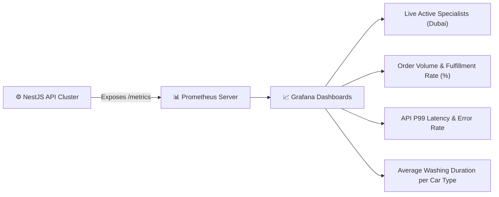

# Audit Logging & Observability

To maintain operational integrity, troubleshoot dispatch exceptions, and ensure security compliance, 800-CarWash incorporates comprehensive audit trails and system observability.

---

## 1. Structured Audit Logging

Every critical business action is logged into an immutable `audit_logs` table and streamed to centralized logging (e.g. Datadog / Grafana Loki / AWS CloudWatch):

```json
{
  "timestamp": "2026-08-15T18:32:10.450Z",
  "action": "ORDER_DISPATCHED",
  "actor": {
    "user_id": "9b1a2c3d-4e5f-6a7b-8c9d-0e1f2a3b4c5d",
    "role": "OPS_ADMIN",
    "email": "ops.lead@800carwash.ae",
    "ip_address": "86.96.12.44"
  },
  "target": {
    "resource": "ORDER",
    "order_id": "8f3b2c1a-5d4e-4f6a-9b8c-1e2d3f4a5b6c",
    "order_number": "800-240815-092"
  },
  "changes": {
    "assigned_specialist_id": {
      "old": null,
      "new": "7a1b2c3d-4e5f-6a7b-8c9d-0e1f2a3b4c5d"
    },
    "status": {
      "old": "ORDER_CREATED",
      "new": "ASSIGNED"
    }
  }
}
```

---

## 2. Monitored Operational Actions
- **Dispatch Actions**: Order assigned, reassigned, or cancelled by Admin.
- **Geofence Modifications**: Polygon updates, sub-zone status toggles.
- **Financial Adjustments**: Promo code creation, loyalty point balance manual modifications.
- **Quality Gates**: Overriding missing inspection photos or cancelling no-shows.

---

## 3. Telemetry & Metrics (Prometheus & Grafana)


