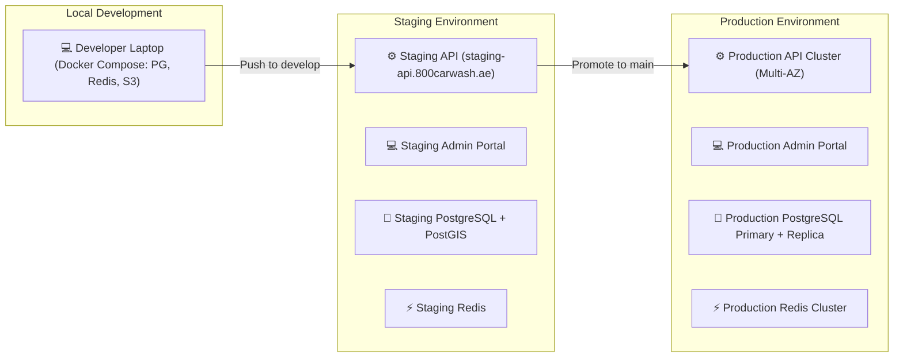
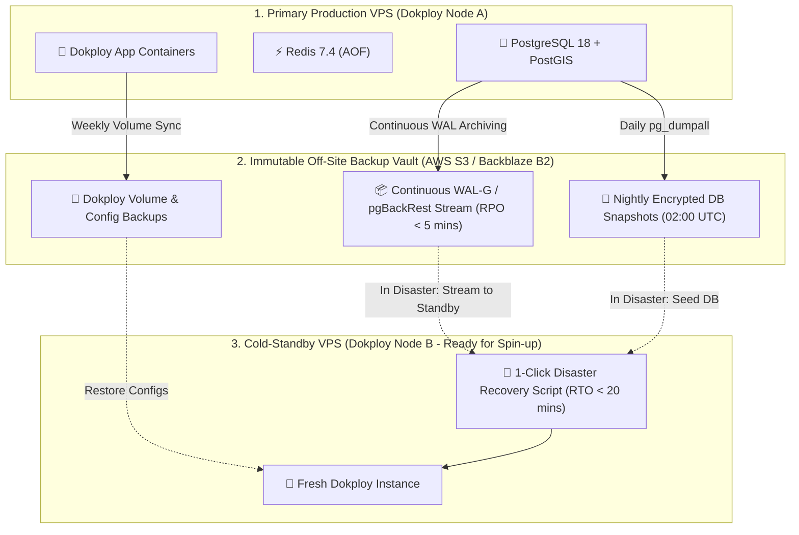

# Environments & DevOps Pipeline

This document defines the deployment topologies, CI/CD pipeline automation, and infrastructure environments for 800-CarWash.

---

## 1. Environment Topology



---

## 2. CI/CD Automation (GitHub Actions)

```mermaid
graph TD
    PR["1. GitHub Pull Request Opened"] --> LINT["2. Lint & Type Check (ESLint / TSC)"]
    LINT --> TEST["3. Automated Unit & Integration Tests (Jest)"]
    TEST --> BUILD["4. Build Validation (Docker Image Build)"]
    BUILD --> MERGE["5. PR Approved & Merged to develop / main"]
    
    MERGE --> DEPLOY_STG["6. Auto-Deploy to Staging Environment"]
---

## 3. Production Deployment Architecture (VPS & Dokploy)

800-CarWash is deployed onto dedicated **VPS infrastructure managed via Dokploy**. This eliminates cloud vendor lock-in and high managed service fees while providing automated GitHub deployments, SSL certificates, and container health management.

Each workload is deployed as an **independent, isolated service container** with dedicated resource allocations:

```mermaid
graph TD
    TRAEFIK["🌐 Dokploy Traefik Edge Proxy (Automatic Let's Encrypt SSL)"]

    subgraph VPS["VPS Host (Ubuntu / Debian LTS managed via Dokploy)"]
        subgraph AppContainers["Application Service Containers"]
            REST_API["⚙️ Container: backend-api (NestJS)<br/>• Port: 3000 (Internal)<br/>• Domain: api.800carwash.ae"]
            WS_GW["⚡ Container: backend-websocket (Socket.io)<br/>• Port: 3001 (Internal)<br/>• Domain: ws.800carwash.ae"]
            WORKERS["🔄 Container: backend-worker (BullMQ)<br/>• Background PDF, notifications & outbox processing"]
            ADMIN["💻 Container: admin-web (Next.js 16)<br/>• Port: 3002 (Internal)<br/>• Domain: admin.800carwash.ae"]
        end

        subgraph InfraContainers["Infrastructure Service Containers"]
            PG["🐘 Container: postgres-postgis<br/>• PostgreSQL 18 + PostGIS 3.5<br/>• Persistent NVMe Volume"]
            REDIS["⚡ Container: redis-cache<br/>• Redis 7.4 with AOF persistence<br/>• Ephemeral Geo, Locks & BullMQ"]
        end
    end

    TRAEFIK -->|https://api.800carwash.ae| REST_API
    TRAEFIK -->|wss://ws.800carwash.ae| WS_GW
    TRAEFIK -->|https://admin.800carwash.ae| ADMIN

    REST_API --> PG
    REST_API --> REDIS
    WS_GW --> REDIS
    WORKERS --> PG
    WORKERS --> REDIS
    ADMIN --> REST_API
```

### Dedicated Service Container Matrix:

| Service Container Name | Runtime Engine | Scaling & Responsibility | Internal Network Access |
| :--- | :--- | :--- | :--- |
| **`backend-api`** | Node.js 22 LTS (NestJS) | Synchronous REST traffic for Customer, Specialist & Admin apps. | Connects to `postgres-postgis` & `redis-cache`. |
| **`backend-websocket`** | Node.js 22 LTS (Socket.io) | Real-time GPS stream fanout, live tracking, and status broadcasts. | Connects to `redis-cache` (Redis Pub/Sub). |
| **`backend-worker`** | Node.js 22 LTS (BullMQ) | Asynchronous Transactional Outbox consumer, PDF invoices & push notifications. | Connects to `postgres-postgis` & `redis-cache`. |
| **`admin-web`** | Next.js 16 (React 19) | Server-rendered operations dashboard and live dispatch board. | Connects to `backend-api` & `backend-websocket`. |
| **`postgres-postgis`**| PostgreSQL 18 + PostGIS 3.5 | Authoritative business state, spatial polygons, and event ledger. | Isolated to internal Docker network. |
| **`redis-cache`** | Redis 7.4 Alpine | Distributed locks, rate limiting, and BullMQ queues. | Isolated to internal Docker network. |

### Operational Advantages of Dokploy VPS Deployment:
---

## 4. Disaster Recovery (DR) & Business Continuity Architecture

When operating on a dedicated VPS with Dokploy, business continuity is guaranteed through **automated off-site replication, point-in-time database recovery (PITR), and rapid cold-standby restoration procedures**.



### 1. RPO & RTO Targets

| Disaster Metric | Target | Technical Mechanism |
| :--- | :--- | :--- |
| **Recovery Point Objective (RPO)** | **< 5 Minutes** | Continuous Write-Ahead Log (WAL) archiving via `WAL-G` or `pgBackRest` streamed to off-site S3 storage. Maximum potential data loss in catastrophic failure is $< 5$ minutes. |
| **Recovery Time Objective (RTO)** | **< 20 Minutes** | Automated disaster restore script that provisions a fresh Dokploy node, restores the latest DB base backup + WAL replay, and switches DNS records. |

---

### 2. The 3-Tier Disaster Backup Strategy

1. **Continuous PostgreSQL WAL Archiving**:
   - PostgreSQL Write-Ahead Logs (`WAL`) are continuously compressed and pushed to an off-site S3 bucket every 60 seconds.
   - Enables **Point-in-Time Recovery (PITR)** to restore the database to the exact second before an accidental drop or corruption.
2. **Nightly Encrypted Full Database Dump**:
   - Automated cron container runs `pg_dumpall | gzip | gpg` every night at `02:00 UTC` and syncs to off-site object storage with a 30-day retention policy.
3. **Dokploy & Environment Volume Backups**:
   - Dokploy compose definitions, `.env.production` secrets, and persistent volume metadata are backed up weekly to a secure private repository / vault.

---

### 3. Rapid Disaster Recovery Runbook (Step-by-Step)

In the event of complete VPS loss (hardware destruction, host provider outage):

```
┌────────────────────────────────────────────────────────────────────────┐
│ 🚨 DISASTER RECOVERY RESTORATION RUNBOOK                               │
├────────────────────────────────────────────────────────────────────────┤
│ Step 1: Provision a fresh VPS (Ubuntu 24.04 LTS) on any provider.      │
│ Step 2: Install Docker & Dokploy (curl -sSL https://dokploy.com/...)   │
│ Step 3: Connect Git repo & pull production environment variables.      │
│ Step 4: Run restore script:                                            │
│         wal-g backup-fetch /var/lib/postgresql/data LATEST             │
│         wal-g wal-fetch ... (Replays WAL up to failure point)          │
│ Step 5: Start Dokploy service containers (postgres, redis, apps).      │
│ Step 6: Update Cloudflare / DNS A-records (api, ws, admin) to new IP.  │
│ ⏱️ Total Elapsed Time: ~15 to 20 minutes                                │
└────────────────────────────────────────────────────────────────────────┘
```

---

### 4. Failure Isolation & Graceful Degradation

- **Transient Power Outage / Reboot**: All containers are configured with `restart: unless-stopped` and healthchecks. Dokploy automatically recovers all application and database containers within 45 seconds of host reboot.
- **Disk Saturation Alert**: Automated disk space monitoring (via Dokploy alerting / Prometheus node-exporter) triggers warnings at 80% capacity to prevent database lockups.


