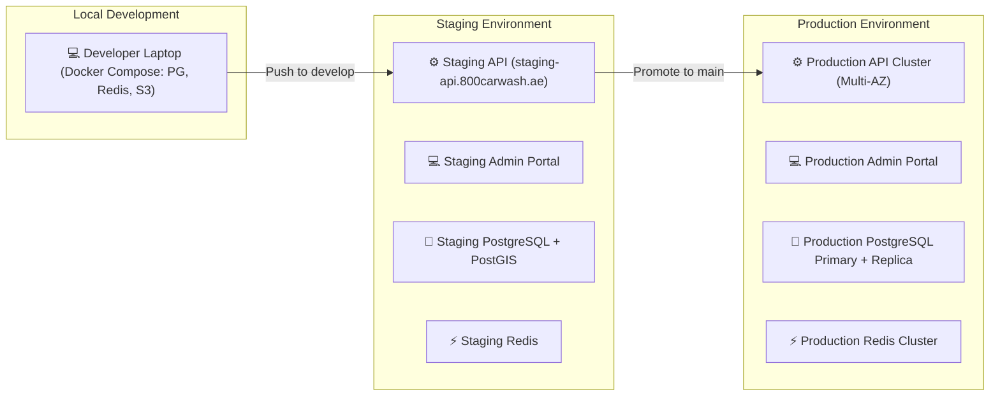

# Environments & DevOps Pipeline

This document defines the deployment topologies, CI/CD pipeline automation, and infrastructure environments for 800-CarWash.

---

## 1. Environment Topology



---

## 2. CI/CD Automation (GitHub Actions)

```mermaid
graph TD
    PR["1. GitHub Pull Request Opened"] --> LINT["2. Lint & Type Check (ESLint / TSC)"]
    LINT --> TEST["3. Automated Unit & Integration Tests (Jest)"]
    TEST --> BUILD["4. Build Validation (Docker Image Build)"]
    BUILD --> MERGE["5. PR Approved & Merged to develop / main"]
    
    MERGE --> DEPLOY_STG["6. Auto-Deploy to Staging Environment"]
---

## 3. Production Process Architecture (AWS ECS / Fargate)

To preserve the modular monolith philosophy while allowing independent scaling of different workloads without the operational complexity of Kubernetes, 800-CarWash deploys three isolated process tiers from a single unified codebase:

```mermaid
graph TD
    ALB["🌐 Application Load Balancer / CloudFront"]

    subgraph ServiceTiers["Independently Scaled ECS Services (800-backend)"]
        REST_API["⚙️ REST API Cluster (NestJS)<br/>• Scaled on CPU & Request Count<br/>• Serves Customer, Specialist & Admin REST traffic"]
        WS_GW["⚡ WebSocket Gateway Cluster (Socket.io)<br/>• Scaled on Active Persistent Connections<br/>• Realtime map streaming & live updates"]
        WORKERS["🔄 Background Worker Cluster (BullMQ)<br/>• Scaled on Redis Queue Depth<br/>• PDF Invoices, Push Notifications & Image Processing"]
    end

    subgraph StorageInfra["Managed Cloud Infrastructure"]
        RDS["🐘 Amazon RDS PostgreSQL 17 + PostGIS (Multi-AZ)"]
        CACHE["⚡ Amazon ElastiCache Redis 7.4 (Cluster Mode)"]
        S3_STORE["☁️ Amazon S3 Storage (Inspection Photos & Invoices)"]
    end

    ALB -->|/api/*| REST_API
    ALB -->|/socket.io/*| WS_GW

    REST_API --> RDS
    REST_API --> CACHE
    WS_GW --> CACHE
    WORKERS --> RDS
    WORKERS --> CACHE
    WORKERS --> S3_STORE
```

### Process Scaling Triggers:
1. **REST API Tier**: Auto-scales based on Target Tracking Scaling (CPU utilization > 60% or target request count per target).
2. **WebSocket Gateway Tier**: Auto-scales based on active concurrent WebSocket connection count (> 2,500 connections per container).
3. **BullMQ Worker Tier**: Auto-scales based on backlog queue depth (e.g. if `queue:invoices` length > 50 jobs).

