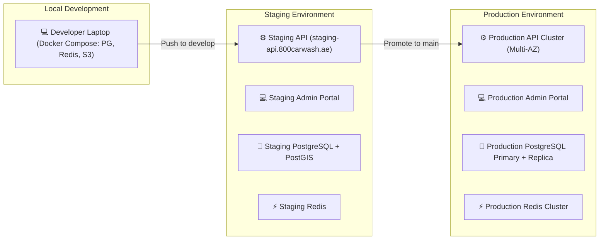
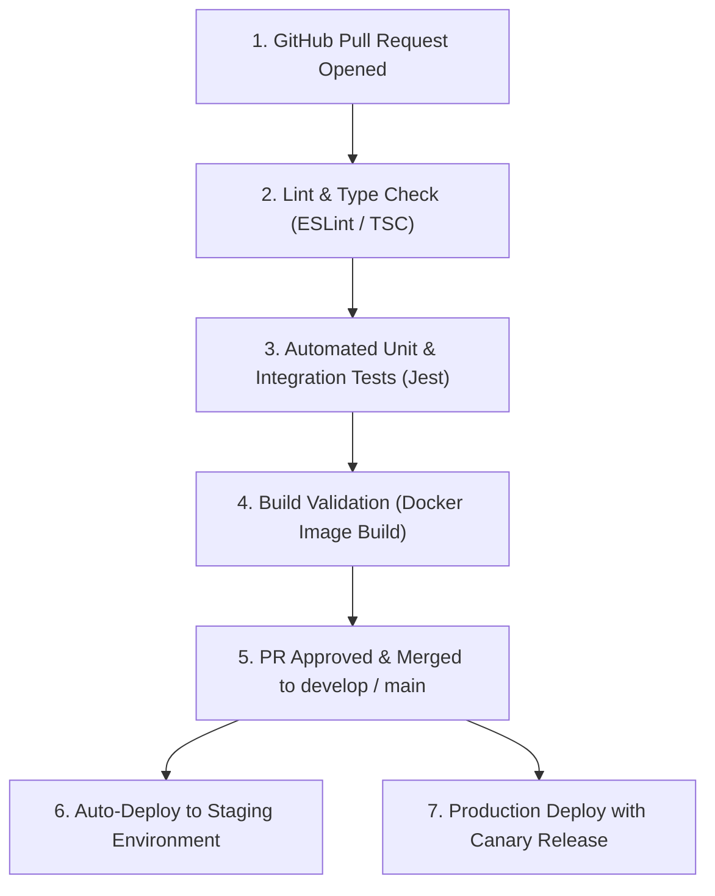

# Environments & DevOps Pipeline

This document defines the deployment topologies, CI/CD pipeline automation, and infrastructure environments for 800-CarWash.

---

## 1. Environment Topology

---

## 2. CI/CD Automation (GitHub Actions)

### Key GitHub Action Workflow Jobs:
1. **Backend Validation**: Runs `pnpm test`, database migration checks against ephemeral PostgreSQL service containers.
2. **Admin Web Portal**: Turbopack Next.js build verification with zero lint errors.
3. **Mobile Apps**: Fastlane automated builds generating staging APKs / iOS TestFlight builds for QA testing.
