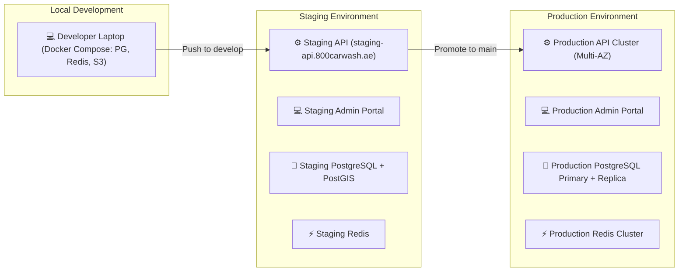

# Environments & DevOps Pipeline

This document defines the deployment topologies, CI/CD pipeline automation, and infrastructure environments for 800-CarWash.

---

## 1. Environment Topology



---

## 2. CI/CD Automation (GitHub Actions)

```mermaid
graph TD
    PR["1. GitHub Pull Request Opened"] --> LINT["2. Lint & Type Check (ESLint / TSC)"]
    LINT --> TEST["3. Automated Unit & Integration Tests (Jest)"]
    TEST --> BUILD["4. Build Validation (Docker Image Build)"]
    BUILD --> MERGE["5. PR Approved & Merged to develop / main"]
    
    MERGE --> DEPLOY_STG["6. Auto-Deploy to Staging Environment"]
---

## 3. Production Deployment Architecture (VPS & Dokploy)

800-CarWash is deployed onto dedicated **VPS infrastructure managed via Dokploy**. This eliminates cloud vendor lock-in and high managed service fees while providing automated GitHub deployments, SSL certificates, and container health management.

Each workload is deployed as an **independent, isolated service container** with dedicated resource allocations:

```mermaid
graph TD
    TRAEFIK["🌐 Dokploy Traefik Edge Proxy (Automatic Let's Encrypt SSL)"]

    subgraph VPS["VPS Host (Ubuntu / Debian LTS managed via Dokploy)"]
        subgraph AppContainers["Application Service Containers"]
            REST_API["⚙️ Container: backend-api (NestJS)<br/>• Port: 3000 (Internal)<br/>• Domain: api.800carwash.ae"]
            WS_GW["⚡ Container: backend-websocket (Socket.io)<br/>• Port: 3001 (Internal)<br/>• Domain: ws.800carwash.ae"]
            WORKERS["🔄 Container: backend-worker (BullMQ)<br/>• Background PDF, notifications & outbox processing"]
            ADMIN["💻 Container: admin-web (Next.js 16)<br/>• Port: 3002 (Internal)<br/>• Domain: admin.800carwash.ae"]
        end

        subgraph InfraContainers["Infrastructure Service Containers"]
            PG["🐘 Container: postgres-postgis<br/>• PostgreSQL 18 + PostGIS 3.5<br/>• Persistent NVMe Volume"]
            REDIS["⚡ Container: redis-cache<br/>• Redis 7.4 with AOF persistence<br/>• Ephemeral Geo, Locks & BullMQ"]
        end
    end

    TRAEFIK -->|https://api.800carwash.ae| REST_API
    TRAEFIK -->|wss://ws.800carwash.ae| WS_GW
    TRAEFIK -->|https://admin.800carwash.ae| ADMIN

    REST_API --> PG
    REST_API --> REDIS
    WS_GW --> REDIS
    WORKERS --> PG
    WORKERS --> REDIS
    ADMIN --> REST_API
```

### Dedicated Service Container Matrix:

| Service Container Name | Runtime Engine | Scaling & Responsibility | Internal Network Access |
| :--- | :--- | :--- | :--- |
| **`backend-api`** | Node.js 22 LTS (NestJS) | Synchronous REST traffic for Customer, Specialist & Admin apps. | Connects to `postgres-postgis` & `redis-cache`. |
| **`backend-websocket`** | Node.js 22 LTS (Socket.io) | Real-time GPS stream fanout, live tracking, and status broadcasts. | Connects to `redis-cache` (Redis Pub/Sub). |
| **`backend-worker`** | Node.js 22 LTS (BullMQ) | Asynchronous Transactional Outbox consumer, PDF invoices & push notifications. | Connects to `postgres-postgis` & `redis-cache`. |
| **`admin-web`** | Next.js 16 (React 19) | Server-rendered operations dashboard and live dispatch board. | Connects to `backend-api` & `backend-websocket`. |
| **`postgres-postgis`**| PostgreSQL 18 + PostGIS 3.5 | Authoritative business state, spatial polygons, and event ledger. | Isolated to internal Docker network. |
| **`redis-cache`** | Redis 7.4 Alpine | Distributed locks, rate limiting, and BullMQ queues. | Isolated to internal Docker network. |

### Operational Advantages of Dokploy VPS Deployment:
1. **Isolated Service Containers**: Every service (API, WebSocket gateway, worker, database, cache) runs in its own dedicated container, preventing background worker CPU spikes from impacting REST or WebSocket throughput.
2. **Git Push-to-Deploy**: Linking the GitHub repository to Dokploy enables zero-downtime automated builds and rolling container restarts on every push to `main`.
3. **Automated SSL/TLS**: Dokploy's integrated Traefik proxy handles automatic Let's Encrypt certificates and HTTP/2 routing for all subdomains.
4. **Internal Network Security**: Database and cache ports (`5432`, `6379`) remain completely unexposed to the public internet, accessible only within the internal Docker bridge network.


