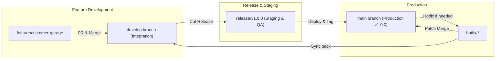

# Git & Release Strategy

This document establishes the repository structure, Git branching model, and semantic release standards for the 800-CarWash development team.

---

## 1. Monorepo Structure

We recommend a unified monorepo or tightly organized multi-repo structure managed with **Turborepo** or **Nx**:

```
800-carwash/
├── apps/
│   ├── backend-core/          # NestJS v11 API & WebSocket Gateway
│   ├── admin-web/             # Next.js 16 / React 19 Operations Portal
│   ├── customer-mobile/       # React Native 0.77+ Customer App
│   └── specialist-mobile/     # React Native 0.77+ Specialist App
├── packages/
│   ├── tsconfig/              # Shared TypeScript configurations
│   ├── eslint-config/         # Shared linting standards
│   ├── types/                 # Shared DTOs, Enums, and Entity interfaces
│   └── ui/                    # Shared UI design tokens & theme constants
└── package.json
```

---

## 2. Git Branching Model (Trunk-Based + Release Branches)



### Branch Conventions:
- `main`: Production-ready code. Protected branch. Direct pushes prohibited; releases deployed automatically via CI/CD.
- `develop`: Integration branch for active development.
- `feature/*`: Short-lived branches created from `develop` for specific user stories (e.g. `feature/loyalty-points-ui`).
- `hotfix/*`: Urgent production fixes branched directly from `main`.

---

## 3. Conventional Commits & Semantic Versioning
All commits must follow the **Conventional Commits** specification:
- `feat(order)`: Add multi-car calculation logic
- `fix(geofence)`: Correct PostGIS polygon SRID bounding box
- `chore(deps)`: Upgrade Next.js to 16.0.1
- `docs(api)`: Update WebSocket event payload definitions
