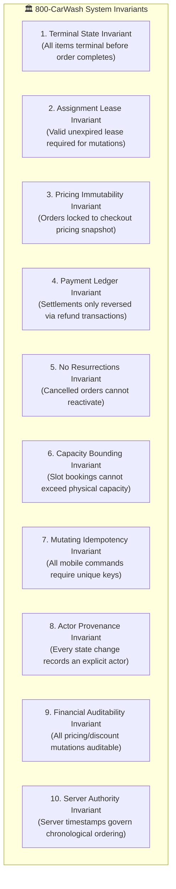
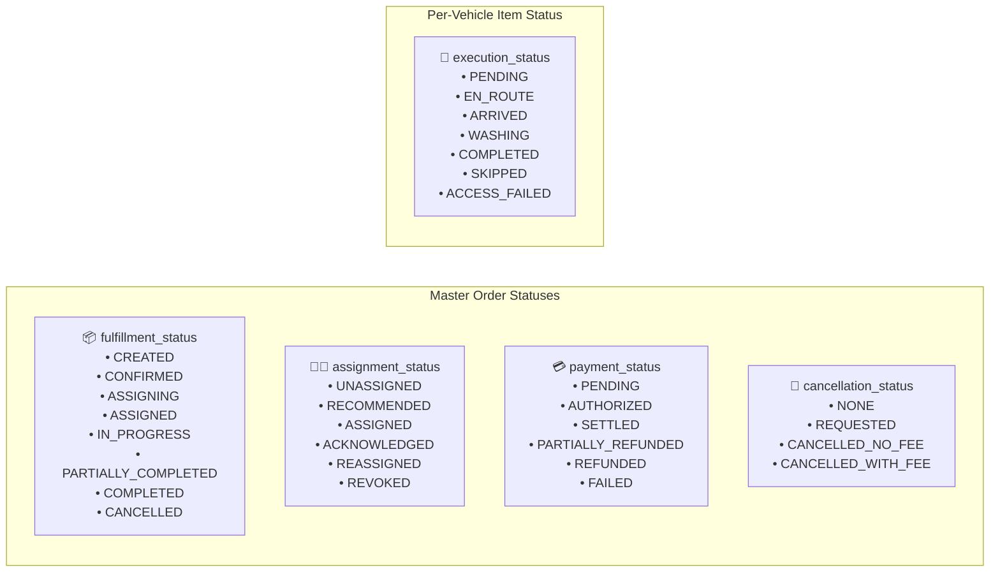

# System Invariants & Failure Matrix

This document defines the **non-negotiable system invariants (the platform constitution)** and the **formal failure matrix** for the 800-CarWash platform. All service implementations, controllers, state machines, and client applications must strictly adhere to these invariants.

---

## 1. The 10 Core System Invariants

### Invariant 1: Terminal State Fulfillment
An order cannot transition to `COMPLETED` or `PARTIALLY_COMPLETED` without every associated `order_item` reaching an explicit terminal state (`COMPLETED`, `SKIPPED`, or `ACCESS_FAILED`).

### Invariant 2: Assignment Lease Authority
A specialist cannot modify an order, advance status, or upload photos unless they hold an active, non-expired, and unrevoked **Assignment Lease** (`lease_version`). If an assignment was revoked or reassigned by an Admin, offline commands from the prior specialist are rejected with `410 Gone`.

### Invariant 3: Pricing & VAT Immutability
Order financial totals cannot be mutated directly after creation. Every order is bound to an immutable `order_pricing_snapshot` JSON record capturing base prices, add-on prices, promo discounts, taxable amount, UAE VAT rate (5.00%), and VAT amount at the exact moment of checkout.

### Invariant 4: Payment Ledger Integrity
A completed or settled payment cannot be deleted or overwritten. Payment reversals must occur exclusively through formal, append-only `refund_transactions` linked to the original payment record.

### Invariant 5: No Resurrections
An order in a `CANCELLED` state can never transition back to an active fulfillment state (`ASSIGNED`, `IN_PROGRESS`, `WASHING`).

### Invariant 6: Slot Capacity Bounding
Booking slot reservations cannot exceed configured sub-zone capacity. Concurrent slot reservations must be locked using database transactions (`SELECT ... FOR UPDATE`) or Redis distributed mutexes to prevent race conditions.

### Invariant 7: Mutating Command Idempotency
Every mutating HTTP request (`POST`, `PUT`, `PATCH`) from mobile clients must supply an `Idempotency-Key` (UUIDv7). Duplicate keys return the identical cached response without re-executing business logic.

### Invariant 8: Actor Provenance
Every state transition across orders, items, assignments, and payments must record an explicit actor (`CUSTOMER`, `SPECIALIST`, `ADMIN`, or `SYSTEM`) with their unique identifier in the `order_events` audit ledger.

### Invariant 9: Financial Auditability
Every price override, coupon application, refund creation, fee waiver, or loyalty credit modification must generate an immutable audit log entry containing before/after snapshots and the executing admin's identity.

### Invariant 10: Server Authority
Device local timestamps submitted from offline mobile clients can be used for informational duration calculations but can **never override server state transition timestamps** or sequence ordering.

---

## 2. Orthogonal Order Status Model

To eliminate semantic conflicts during multi-car fulfillment, 800-CarWash decouples lifecycle status into 5 orthogonal dimensions:

---

## 3. Production Failure Matrix

The platform specifies deterministic behavior for all real-world operational and infrastructure failure scenarios:

| Failure Scenario | Component Affected | Immediate Expected System Behavior | Recovery / Reconciliation |
| :--- | :--- | :--- | :--- |
| **Customer network drops during checkout** | Customer Mobile App | App retries request with identical `Idempotency-Key`. | API returns cached order payload; no double booking occurs. |
| **Technician enters basement parking (No 4G/5G)** | Specialist Mobile App | App stores `WASH_STARTED` / `WASH_COMPLETED` commands in local SQLite queue. | App flushes queue chronologically with `commandId` upon network reconnection. |
| **Technician phone battery dies during job** | Dispatch / Specialist | Specialist misses heartbeat pings (> 45s). | Watchdog flags specialist as `UNRESPONSIVE (STALE)` on Admin Board; Admin can reassign lease. |
| **Technician reconnects after reassignment** | Specialist App Sync | Stale specialist attempts to submit wash complete. | API rejects with `410 Gone (LEASE_REVOKED)` preventing dual execution conflicts. |
| **Redis Cache / PubSub Outage** | Real-Time Layer | Real-time map pins temporarily degrade; WebSocket pushes fail. | **REST API remains authoritative source of truth**; apps fetch fresh state via REST polling fallback. |
| **SMS / OTP Provider Outage** | Auth / Notifications | Circuit breaker trips after 5 consecutive failures. | Outbound SMS automatically falls back to WhatsApp OTP or in-app inbox queue. |
| **S3 Media Upload Timeout** | Photo Audit Pipeline | S3 pre-signed upload fails or times out. | Mobile app retains local compressed image and retries upload asynchronously in background. |
| **Admin WebSocket Disconnects** | Operations Portal | Live map stream disconnects. | Portal automatically reconnects and triggers an authoritative state snapshot fetch via REST. |
| **Payment Gateway Outage (Phase 2)** | Billing Module | Online card authorization fails. | Order transitions `payment_status` to `PAYMENT_PENDING` / `FAILED`; customer prompted to retry or switch to COD. |
| **PostgreSQL Database Outage** | Core Persistence | System fails closed; health check fails ALB. | AWS Multi-AZ automatic failover triggers read-replica promotion. |
| **Worker Process Crash** | BullMQ Workers | Background PDF invoice or push job terminates mid-flight. | BullMQ automatically retries job with exponential backoff; workers execute jobs idempotently. |
