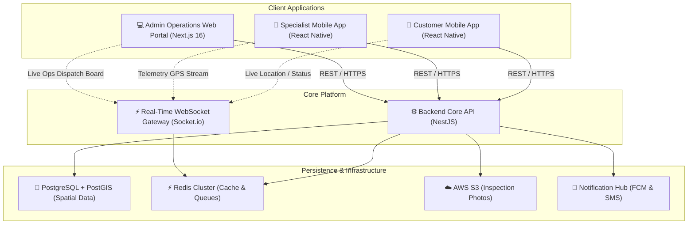
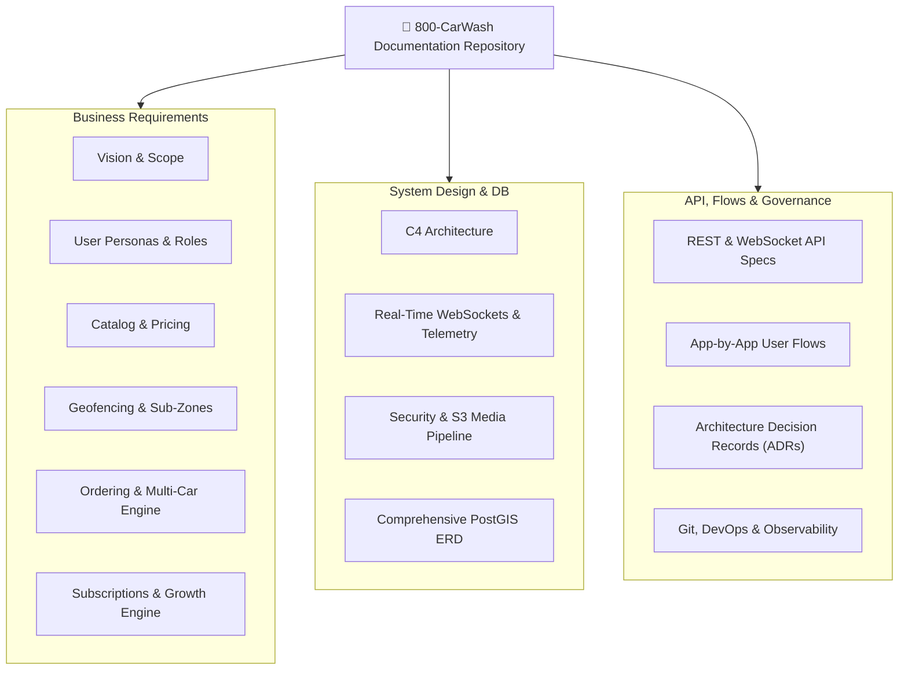

# 800-CarWash Platform Engineering Documentation

Welcome to the technical design and architectural documentation for **800-CarWash**, the enterprise-grade on-demand and subscription-based mobile car wash ecosystem operating across Dubai and the UAE.

---

## Executive Summary

800-CarWash is a hyper-local, multi-platform fleet and on-demand car care solution. It bridges the gap between vehicle owners and mobile detailing specialists with pinpoint GIS accuracy, seamless booking pipelines, and real-time operations dispatching.

---

## Core System Highlights

| Feature Area | Architectural Implementation |
| :--- | :--- |
| **Multi-Application Ecosystem** | 1 Centralized Modular Monolith Backend (NestJS 11), 1 Admin Web Portal (Next.js 16), 2 Mobile Apps (Customer & Specialist in React Native 0.77+). |
| **Spatial Precision** | Native PostgreSQL with **PostGIS extension** executing polygon bounding checks (`ST_Contains`) for Dubai sub-zones and out-of-boundary prevention. |
| **Multi-Car Order Engine** | Atomic 1-to-Many Order architecture with discrete per-car item state machines (`COMPLETED`, `SKIPPED`, `ACCESS_FAILED`) and automated partial refund sagas. |
| **Operations Dispatch Model** | V1.5 Smart Recommendation Dispatching with proximity scoring + fallback manual direct assignment. |
| **Fault Tolerance & Idempotency** | Mandatory client-side `Idempotency-Key` headers (UUIDv7 + Redis locks), tiered sliding-window rate limiters, and `Opossum` circuit breakers. |
| **Quality Control & UAE PDPL** | S3 pre-signed direct photo uploads with automated 90-day data retention lifecycle rules compliant with UAE Data Protection Law. |
| **Observability & Health** | End-to-end OpenTelemetry distributed tracing (`x-trace-id`), structured Pino JSON logging, Redis TTL Heartbeat Watchdogs, and defined P95 latency SLOs. |

---

## Document Navigation

This documentation repository is partitioned into 7 focused engineering pillars:

---

## Getting Started

- Dive into [Ecosystem & Applications](overview/ecosystem.md) to understand the role of each client.
- Explore the [Technology Stack](overview/tech-stack.md) for full versioning and library choices.
- Review [Vision & Scope](business/vision.md) to understand the business workflows.
