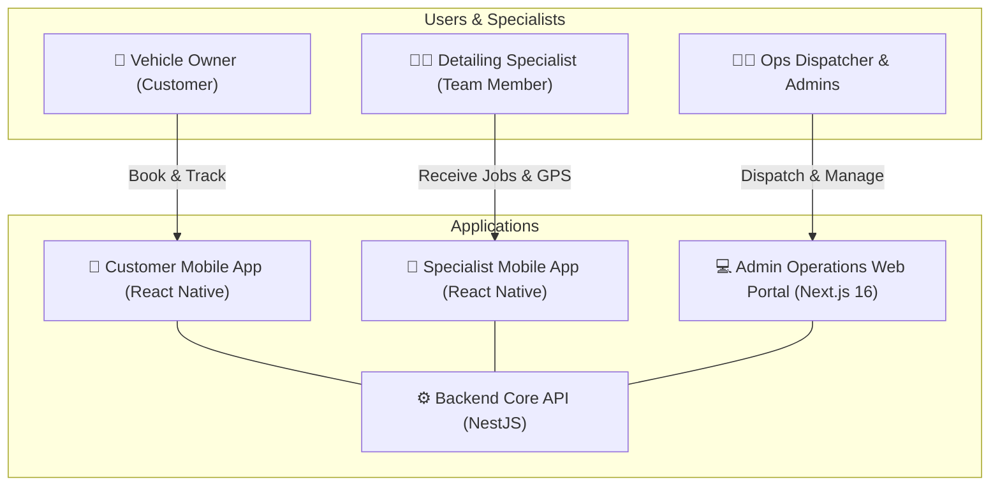

# Ecosystem & Applications

The 800-CarWash platform comprises four tightly coupled, purpose-built applications operating around a single source of truth.

---

## The Four-Application Ecosystem

---

## Detailed Application Breakdown

### 1. Backend Core API & WebSocket Server (`backend-core`)

The central nervous system of 800-CarWash:

- **Framework**: NestJS (TypeScript, Node.js v22+ LTS).
- **Core Responsibilities**:
    - **Authentication & RBAC**: Issues JWTs, handles phone OTP verification for customers, and credentials-based authentication for specialists & admins.
    - **Spatial Engine**: Computes Point-in-Polygon (PIP) checks via PostGIS to validate service availability in Dubai zones and sub-zones.
    - **Order & Pricing State Machine**: Validates car types, calculates prices based on base service + add-on matrices, checks daily/hourly slot capacities, and manages order lifecycle transitions.
    - **Real-Time Telemetry & Dispatch**: Broadcasts live specialist location updates, pushes state transitions via WebSockets (Socket.io) backed by Redis Pub/Sub.
    - **Asset Manager**: Generates pre-signed S3 URLs for direct client uploads of 2–4 inspection photos before/after service.
    - **Invoicing & Communications**: Issues transactional emails with PDF tax invoices, coordinates SMS OTPs, and triggers FCM push notifications.

---

### 2. Admin Operations Web Portal (`admin-web`)

The mission control dashboard for operational managers, fleet supervisors, and executive admins:

- **Framework**: Next.js 16 (React 19, Tailwind CSS, Shadcn UI / Radix UI, TanStack Query).
- **Key Modules**:
    - **Live Ops Dispatch Board**: Visual map showing all active specialists across Dubai sub-zones with current operational status (`AVAILABLE`, `EN_ROUTE`, `WASHING`, `OFFLINE`).
    - **Manual Dispatch Interface**: Dedicated queue to assign incoming on-demand and scheduled orders directly to the nearest specialist.
    - **Service & Pricing Matrix**: Full control over car types (Sedan, SUV, Luxury, etc.), core services, add-on groups, and duration configurations.
    - **Geofence Editor**: Visual polygon drawer and editor for Dubai boundaries and operational sub-zones.
    - **Slot & Capacity Manager**: Time-slot definition (e.g. 09:00, 10:00) with configurable per-slot, per-zone booking limits.
    - **Promotions & Loyalty Hub**: Rule-based promo code generator (fixed/percentage discounts, product targeting, first-time user restrictions), loyalty conversion rates, and referral incentives.
    - **Audit & Financial Reporting**: Order history, specialist performance logs, inspection photo viewer, and cash/POS reconciliation logs.

---

### 3. Customer Mobile App (`customer-mobile`)

The customer-facing application available on iOS and Android:

- **Framework**: React Native (Expo / Bare Workflow, TypeScript).
- **Key Features**:
    - **Frictionless Auth**: Quick Phone OTP registration and login.
    - **Vehicle Garage**: Multi-car management with car brand, model, registered emirate/city, plate code, plate number, color, and car type classification.
    - **Saved Location Book**: Map pin picker with reverse geocoding, address labels (Home, Office, Garage, Custom), apartment/villa numbers, parking spot details, and access instructions.
    - **Multi-Car Booking Flow**: Add multiple vehicles in a single order, configuring custom services and add-ons independently for each vehicle.
    - **Scheduling**: Choose between instant On-Demand (~30 min ETA) or precision start-time slots.
    - **Live Tracking**: Real-time map displaying the dispatched specialist's journey, live ETA, and real-time status transitions (`EN_ROUTE`, `ARRIVED`, `WASHING`, `COMPLETED`).
    - **In-App Order Modifications**: Real-time approval sheet if a specialist adds an on-site upsell add-on.
    - **Rating, Tipping & Invoicing**: Post-wash 1–5 star rating, 100% staff tipping, and instant email invoice receipt.
    - **Subscriptions & Rewards**: Manage recurring weekly/bi-weekly plans, view loyalty point balance, and share referral codes.

---

### 4. Specialist / Team Member Mobile App (`specialist-mobile`)

The on-field companion for detailing technicians:

- **Framework**: React Native (TypeScript).
- **Key Features**:
    - **Secure Shift Login**: Admin-issued credentials with shift toggle (Active / On Break / Sick / Offline).
    - **Job Queue**: View assigned orders sorted by schedule and priority.
    - **Turn-by-Turn Navigation**: Deep linking to Google Maps / Waze with exact parking spot notes and gate access instructions.
    - **En Route GPS Telemetry**: Background location service streaming coordinates every 5–10 seconds to the backend while on active journey.
    - **Photo Quality Gate**: Camera integration enforcing 2–4 mandatory "Before Wash" and "After Wash" photos per vehicle before order status can advance.
    - **On-Site Add-on Requester**: Interface to append additional detailing services requested by customer on-site, waiting for digital customer confirmation.
    - **Payment Settlement**: Record Cash on Delivery or Card on Delivery (POS reference optional in v1).
