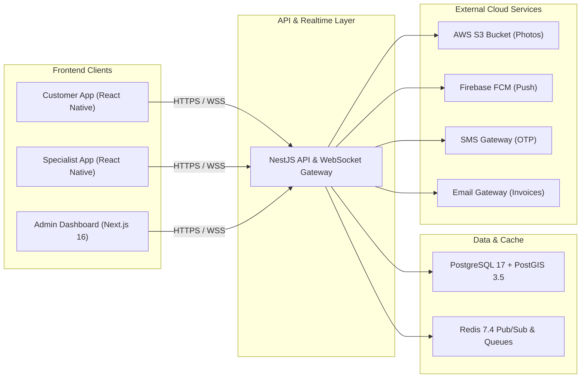

# Technology Stack

The 800-CarWash platform leverages a modern, enterprise-grade, high-performance technology stack. All frameworks, libraries, and runtime environments adhere to current LTS and latest stable production versions.

---

## Technology Matrix

| Layer | Technology | Version | Key Justification & Purpose |
| :--- | :--- | :--- | :--- |
| **Backend Core** | NestJS | `v11.x` | Enterprise modular TypeScript architecture, dependency injection, decorators, built-in validation & microservice capability. |
| **Runtime Engine** | Node.js | `v22.x LTS` | Ultra-fast V8 JavaScript engine, native Fetch API, enhanced diagnostic capabilities. |
| **Primary Database** | PostgreSQL + PostGIS | `PostgreSQL 17+` / `PostGIS 3.5+` | Relational integrity + spatial GIS indexing (`GIST`) for polygon geofencing and distance calculations. |
| **Cache & Queue** | Redis | `v7.4+` | Real-time geospatial location caching, Pub/Sub for WebSockets, BullMQ for asynchronous queue jobs. |
| **Admin Web Portal** | Next.js | `v16.x` (React 19) | Server Components, fast rendering, Turbopack, App Router, responsive operations dashboard. |
| **Admin UI Framework** | Tailwind CSS + Shadcn UI | `Tailwind v4.x` | Clean, responsive, dark/light accessible UI system with Radix UI primitives. |
| **Mobile Applications** | React Native | `v0.77+` | Cross-platform (iOS & Android) with New Architecture (Fabric & TurboModules), single codebase efficiency. |
| **Mobile OTA Updates** | Expo Updates / CodePush | EAS Update / Self-hosted OTA | Over-the-Air instant JavaScript bundle & asset delivery without App Store / Play Store review cycles. |
| **UAE Map & Geocoding**| MapLibre + TileServer + Photon | OpenStreetMap UAE Extract | Zero-cost self-hosted vector map tiles, address autocomplete search, reverse geocoding & OSRM routing. |
| **Real-Time Gateway** | Socket.io | `v4.8+` | Bidirectional low-latency WebSocket connection with Redis adapter for horizontal scaling. |
| **Object Storage** | Amazon S3 / MinIO | S3 API Standard | Secure, encrypted bucket storage for mandatory before/after vehicle inspection photos. |
| **Push Notifications** | Firebase Cloud Messaging (FCM) | HTTP v1 API | High-reliability background and foreground push notification delivery to iOS & Android clients. |
| **SMS & Auth OTP** | Twilio / Infobip API | REST API | Reliable phone number verification and OTP authentication for customer accounts. |
| **Email Invoicing** | SendGrid / AWS SES | REST / SMTP | Transactional email delivery with attached PDF tax invoices and order confirmations. |

---

## Architectural Interaction Diagram

---

## Package & Tooling Standards

### Backend Core (`NestJS`)
- **ORM**: Prisma ORM `v6.x` or TypeORM `v0.3.x` with native spatial query integration.
- **Queueing Engine**: BullMQ with Redis for background invoice generation, email dispatching, and SMS dispatch.
- **Validation**: `class-validator` and `class-transformer` for strict DTO validation.
- **Documentation**: Swagger / OpenAPI `@nestjs/swagger` with auto-generated schemas.

### Admin Web App (`Next.js 16`)
- **State Management**: TanStack Query (`v5`) for asynchronous server state + Zustand for client state.
- **Map & Spatial Editing**: `@vis.gl/react-google-maps` or Mapbox GL JS with polygon drawing controls.
- **Forms**: React Hook Form + Zod schema validation.

### Mobile Apps (`React Native`)
- **Navigation**: React Navigation `v7`.
- **Maps & Geolocation**: `react-native-maps` + `react-native-geolocation-service` (background streaming enabled for Specialists).
- **Camera & Media**: `react-native-vision-camera` / `expo-image-picker` with client-side image compression before S3 upload.
