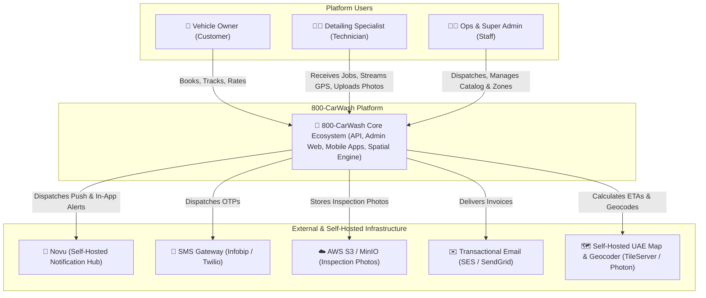
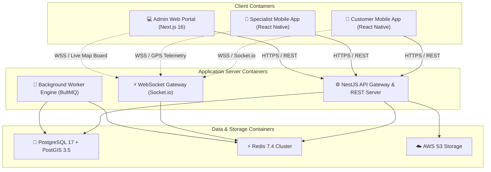
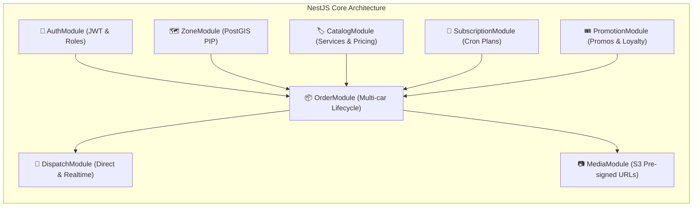

# High-Level C4 Architecture

This section describes the high-level system architecture for the 800-CarWash platform utilizing the **C4 Model** (Context, Container, and Component diagrams).

---

## 1. C4 Level 1: System Context Diagram

The System Context diagram illustrates the boundary of the 800-CarWash ecosystem, its primary users, and external third-party integrations.

---

## 2. C4 Level 2: Container Diagram

The Container diagram zooms into the software containers that form the 800-CarWash system.

---

## 3. C4 Level 3: Component Diagram (Backend Core)

Inside the **NestJS Backend Core**, modular micro-domains encapsulate business capabilities:

