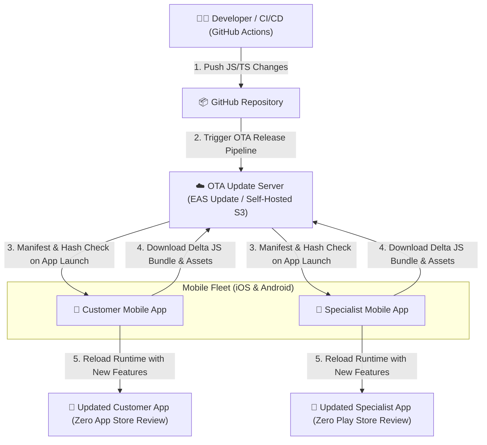
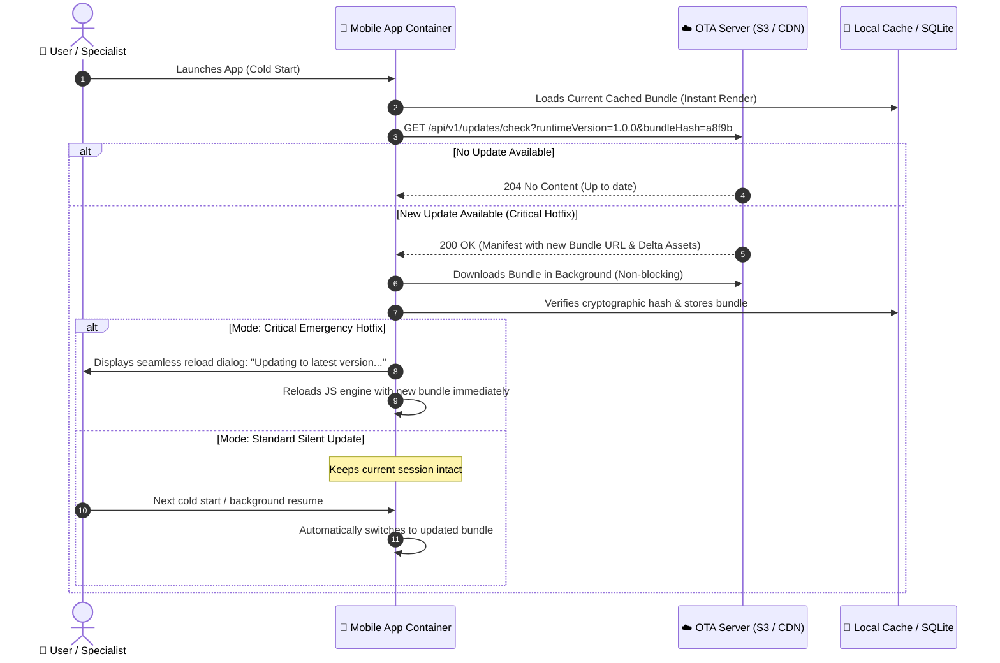

# Over-the-Air (OTA) Mobile Update System

To maintain high development velocity, fix critical production bugs instantly, and roll out feature updates to both **Customer Mobile App** and **Specialist Mobile App** without waiting 24–48 hours for App Store and Google Play Store review cycles, 800-CarWash incorporates an **Over-the-Air (OTA) Dynamic Code Update Architecture**.

---

## 1. High-Level OTA Architecture

React Native separates native binary container code (`Objective-C/Swift/Java/Kotlin`) from the application's runtime JavaScript bundle and static assets (images, icons, styles). The OTA system dynamically swaps the JS bundle over HTTPS upon launch.

---

## 2. When to Use OTA vs. Native Store Release

The following decision matrix governs when code changes are shipped via instant OTA vs. binary store builds:

| Change Category | Delivery Mechanism | Deployment Time | Store Approval Required? |
| :--- | :--- | :--- | :--- |
| **Bug Fixes & UI Tweaks** | ⚡ **OTA Update** | < 2 minutes | ❌ No |
| **New Screen / Flow Additions** | ⚡ **OTA Update** | < 2 minutes | ❌ No |
| **Pricing & Catalog Logic Changes** | ⚡ **OTA Update** | < 2 minutes | ❌ No |
| **Copy & Localization Strings** | ⚡ **OTA Update** | < 2 minutes | ❌ No |
| **New Native Modules** (e.g. New Bluetooth SDK) | 📦 **Binary Release** | 24–48 hours | ✅ Yes (App Store & Play Store) |
| **App Permissions Change** (e.g. Background Location) | 📦 **Binary Release** | 24–48 hours | ✅ Yes |
| **React Native Engine Upgrade** | 📦 **Binary Release** | 24–48 hours | ✅ Yes |

---

## 3. Update Lifecycle & Client Strategies

Both mobile applications implement a resilient update lifecycle to ensure customers and specialists are never interrupted while using the app:

---

## 4. Rollback & Fault-Tolerance Guardrails

To prevent faulty JavaScript bundles from bricking customer or specialist devices:

1. **Automatic Health Check (Crash Detection)**:
   - Upon loading a new OTA bundle, an internal watchdog timer monitors initialization.
   - If an unhandled fatal JavaScript error occurs within 10 seconds of launch, the app automatically reverts to the previous known stable embedded bundle.
2. **Channel & Environment Staging**:
   - `preview`: Automatically received by internal QA and beta testers upon merging to `develop`.
   - `production`: Released to live users upon tagging a release on `main`.
3. **Phased / Rollout Percentage**:
   - Updates can be targeted to 10%, 25%, 50%, then 100% of devices while monitoring error rates via Sentry/Crashlytics.
