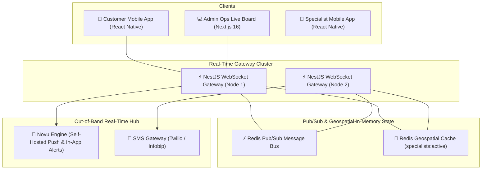
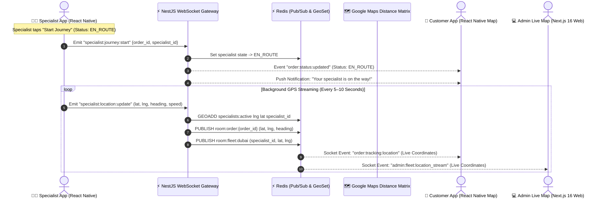

# Real-Time Telemetry & Communication Architecture

Real-time communication in 800-CarWash powers live specialist GPS tracking, instant status synchronizations, on-site upsell approvals, in-app messaging/chat, and background push notifications.

---

## 1. High-Level Real-Time Topology

---

## 2. Real-Time Live Map Tracking Workflow

When a specialist taps **"Start Journey"** in the Specialist App, the live tracking pipeline activates:

---

## 3. Client Map Rendering & Animation Strategies

### A. Customer Mobile App (`react-native-maps`)
1. **Marker Position Interpolation**: Rather than jumping abruptly, the specialist car icon uses `AnimatedRegion` / linear coordinate interpolation to animate smoothly over 5–10 second update intervals.
2. **Bearing & Rotation**: The car marker rotates smoothly based on the `heading` attribute (0°–360°) to reflect the technician vehicle's actual driving direction.
3. **Route Polyline**: Draws a route polyline between the specialist's current location and the customer's vehicle pin using Google Directions API.
4. **Dynamic ETA Badge**: Shows dynamic arrival time (e.g. `Arriving in ~12 mins`).

### B. Admin Web Portal (`Next.js 16` + Vector Maps)
1. **Dubai Master Fleet Map**: Interactive Mapbox GL JS / Google Maps Canvas rendering all active specialists across all Dubai sub-zones simultaneously.
2. **Color-Coded Status Pulsing**:
   - 🔵 **Blue Vehicle Pin**: `EN_ROUTE` to a customer.
   - 🟠 **Orange Vehicle Pin**: Currently `WASHING` on-site.
   - 🟢 **Green Vehicle Pin**: `AVAILABLE` for dispatch.
3. **Breadcrumb Trail & Telemetry Inspection**: Ops dispatchers can click any specialist pin to view live speed, heading, battery/device status, and assigned order trail.

| Channel / Room Pattern | Target Subscribers | Broadcast Events |
| :--- | :--- | :--- |
| `room:order:{order_id}` | Assigned Customer & Specialist | Live specialist GPS, order status transitions (`EN_ROUTE`, `ARRIVED`, `WASHING`, `COMPLETED`), per-car wash progress, on-site upsell requests, in-app chat. |
| `room:fleet:dubai` | Ops Dispatchers (Admin Portal) | Real-time coordinates of all on-duty specialists across Dubai sub-zones, shift changes. |
| `room:subzone:{subzone_id}`| Ops Dispatchers & Local Fleet | New incoming unassigned orders, slot capacity saturation alerts. |
| `user:specialist:{id}` | Specific Specialist | Direct dispatch assignment push, order cancellation alerts. |
| `user:customer:{id}` | Specific Customer | Account alerts, payment confirmations, loyalty bonus awarded. |

---

## 4. In-App Real-Time Communication Use Cases

### A. Real-Time Order Modification (On-Site Upsell)
When a customer requests an extra detailing service on-site:
1. Specialist selects add-on in app $\rightarrow$ Emits `order:upsell:requested`.
2. Customer app instantly opens a confirmation bottom-sheet with price difference.
3. Customer taps "Accept" $\rightarrow$ Emits `order:upsell:accepted`.
4. Invoice and specialist app reflect the updated order total in real time.

### B. In-App Direct Chat & Call Masking
- Integrated real-time messaging room (`room:order:{order_id}:chat`) allowing the customer and technician to communicate parking gate codes or apartment directions without exposing personal phone numbers.

### C. Live No-Show Grace Period Countdown
- If a vehicle is locked, specialist taps "Report Inaccessible" $\rightarrow$ A synchronized 10-minute countdown timer broadcasts to both Customer App and Admin Dashboard via WebSockets.
