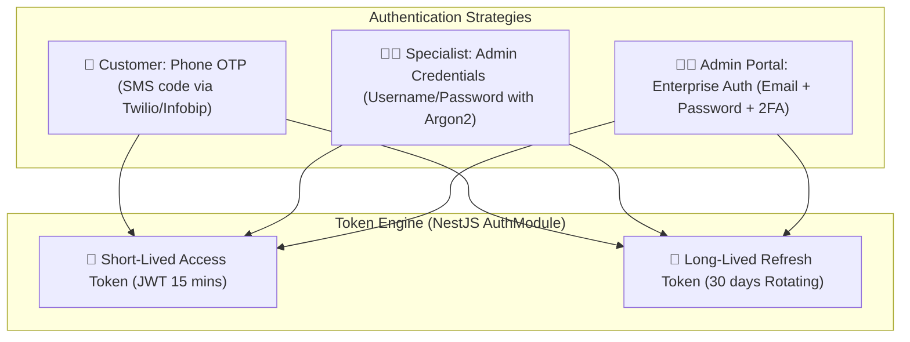
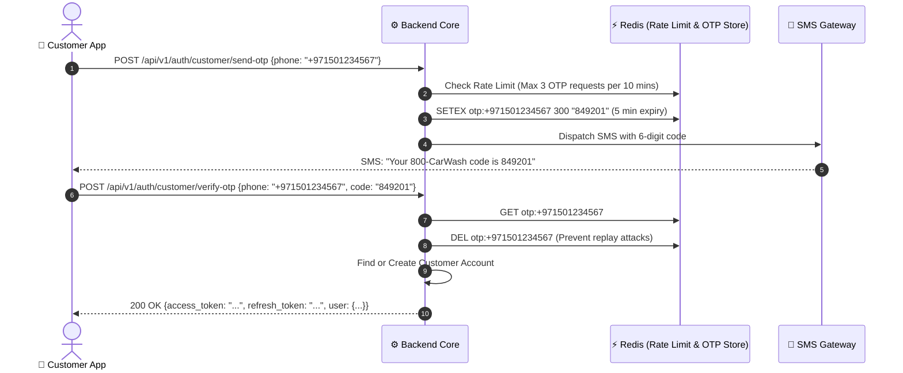

# Security & Authentication

800-CarWash enforces defense-in-depth security principles across mobile clients, administrative interfaces, and backend services.

---

## 1. Multi-Persona Authentication Architecture

---

## 2. Customer Phone OTP Workflow

---

## 3. Data Protection & Security Controls
1. **Network Security**:
    - Enforced HTTPS / TLS 1.3 across all endpoints.
    - Strict CORS policies restricting Admin API routes to authorized domain origins.
2. **Password Security**:
    - Specialist and Admin passwords hashed using **Argon2id** with salt.
3. **Data at Rest & Transit**:
    - Database storage encrypted via AES-256.
    - S3 buckets configured with server-side encryption (`SSE-S3` / `SSE-KMS`) and private access only.
4. **Rate Limiting & DDoS Prevention**:
    - Redis-backed distributed rate limiting via NestJS `@nestjs/throttler` (e.g. 100 req/min for general API, 5 req/min for auth).
