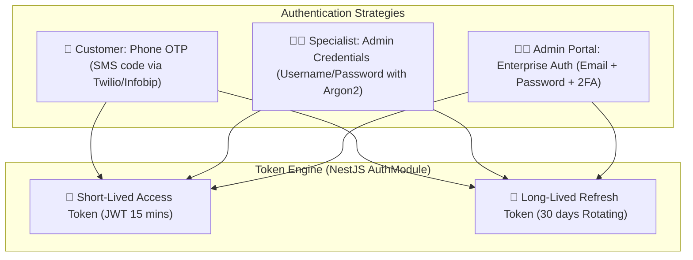
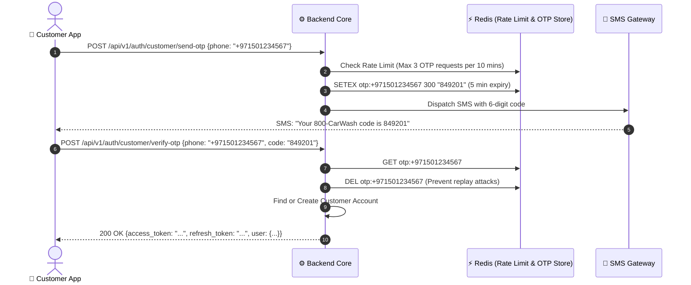

# Security & Authentication

800-CarWash enforces defense-in-depth security principles across mobile clients, administrative interfaces, and backend services.

---

## 1. Multi-Persona Authentication Architecture



---

## 2. Customer Phone OTP Workflow



---

---

## 3. Refresh-Token Family Tracking & Rotation

To prevent token theft and replay attacks on mobile clients, 800-CarWash enforces **Refresh Token Family Rotation**:

```sql
CREATE TABLE refresh_tokens (
  id UUID PRIMARY KEY DEFAULT gen_random_uuid(),
  user_id UUID NOT NULL REFERENCES users(id),
  token_hash VARCHAR(255) NOT NULL,
  family_id UUID NOT NULL,
  device_id VARCHAR(100) NOT NULL,
  issued_at TIMESTAMPTZ DEFAULT NOW(),
  expires_at TIMESTAMPTZ NOT NULL,
  revoked_at TIMESTAMPTZ,
  replaced_by UUID REFERENCES refresh_tokens(id)
);
```

- **Replay Detection**: If a previously used refresh token is presented, the system detects a token reuse breach, immediately **invalidates the entire token family**, and forces the user to re-authenticate with OTP.

---

## 4. Granular Permission & Authorization Matrix

In addition to coarse roles (`CUSTOMER`, `SPECIALIST`, `DISPATCHER`, `SUPER_ADMIN`), the platform enforces granular permission guards:

| Domain | Permission Code | Description | Authorized Roles |
| :--- | :--- | :--- | :--- |
| **Orders** | `ORDER_VIEW` | View order details and active progress | `CUSTOMER`, `SPECIALIST`, `DISPATCHER`, `ADMIN` |
| **Orders** | `ORDER_ASSIGN` | Assign / reassign specialist to an order | `DISPATCHER`, `ADMIN` |
| **Orders** | `ORDER_CANCEL` | Cancel active orders & select reason | `DISPATCHER`, `ADMIN` |
| **Financials**| `REFUND_CREATE` | Authorize partial or full refunds | `FINANCE_ADMIN`, `SUPER_ADMIN` |
| **Catalog** | `PRICE_EDIT` | Modify base service and add-on pricing | `SUPER_ADMIN` |
| **Zones** | `ZONE_EDIT` | Create/edit PostGIS polygon boundaries | `OPS_ADMIN`, `SUPER_ADMIN` |
| **Users** | `USER_SUSPEND` | Suspend customer or specialist account | `OPS_ADMIN`, `SUPER_ADMIN` |
| **Analytics** | `REPORT_VIEW` | Access GMV, revenue, and audit reports | `EXECUTIVE`, `SUPER_ADMIN` |

---

## 5. Enterprise Admin Portal Authentication
- **OIDC / SAML SSO**: Operations and Admin web portals support Google Workspace / Microsoft Entra OIDC Single Sign-On.
- **Mandatory MFA**: Multi-Factor Authentication (TOTP via Authenticator App) enforced for all administrative and dispatch roles.

