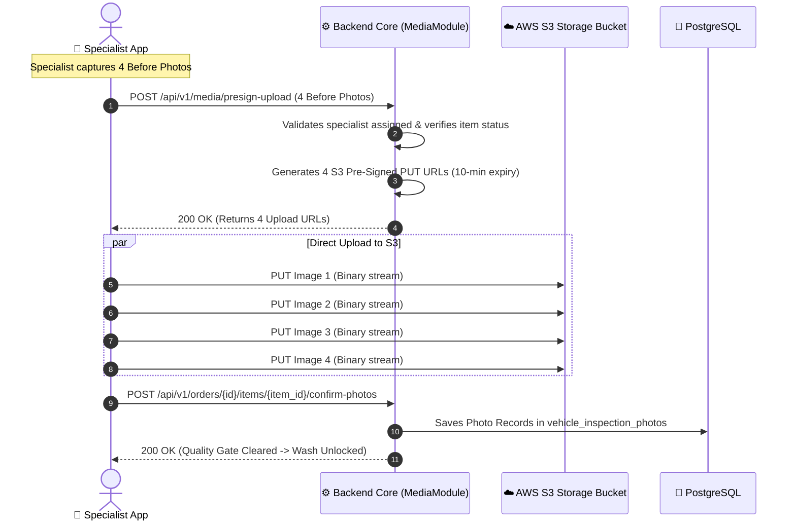

# Storage & Media Pipeline (Future Release Specification)

> [!NOTE]
> **Version Scope**: In the current production release, vehicle inspection photo capture is disabled to streamline field execution times. The media storage architecture below is prepared for future version deployment.

---

## 1. Direct-to-S3 Pre-Signed Upload Architecture (Planned)

To minimize backend server load and memory spikes, mobile clients upload high-resolution inspection photos **directly to Amazon S3** using cryptographically signed pre-signed URLs.



---

## 2. Storage Organization & Key Conventions

S3 object keys are hierarchically structured for rapid partitioning and deterministic retrieval:

```
s3://800carwash-media-prod/
├── orders/
│   └── {order_id}/
│       └── items/
│           └── {order_item_id}/
│               ├── before/
│               │   ├── 01_front_angle.jpg
│               │   ├── 02_rear_angle.jpg
│               │   ├── 03_left_profile.jpg
│               │   └── 04_right_profile.jpg
│               └── after/
│                   ├── 01_front_angle.jpg
│                   ├── 02_rear_angle.jpg
│                   ├── 03_left_profile.jpg
│                   └── 04_right_profile.jpg
├── invoices/
│   └── {order_id}/
│       └── invoice_tax_800_10921.pdf
└── vehicles/
    └── catalog/
        └── {brand_id}/
            └── logo.svg
```

---

## 3. Image Optimization & Compression
- **Client-Side Compression**: Mobile app compresses captured JPEG photos before upload (target: max $1920 \times 1080$, quality: 80%, file size $\approx 300\text{--}500\text{ KB}$ per image).
- **Lifecycle Policy**: S3 lifecycle rules transition inspection photos older than 180 days to S3 Standard-Infrequent Access (Standard-IA) and Glacier Flexible Retrieval after 365 days for cost optimization.
