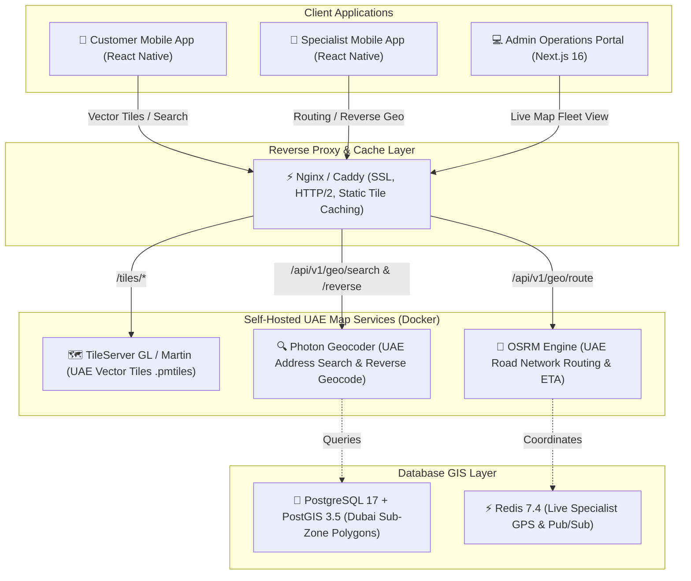

# Self-Hosted UAE Map & Geocoding Architecture

To eliminate expensive third-party mapping API fees (such as Google Maps API costs for geocoding, tile requests, and dynamic maps), 800-CarWash deploys an **enterprise-grade, self-hosted OpenStreetMap (OSM) stack** scoped specifically to the **United Arab Emirates (UAE)**.

---

## 1. Architectural Overview & Component Topology

The entire UAE mapping suite runs in containerized microservices alongside the platform's core infrastructure on a single **8 vCPU / 24 GB RAM / 200 GB NVMe** server node:



---

## 2. Component Breakdown & Resource Footprint

Targeting exclusively the **United Arab Emirates (UAE)** keeps the system footprint extremely compact, enabling the entire dataset to remain memory-resident in RAM for sub-millisecond response times:

| Component | Technology | UAE Dataset Size | RAM Footprint | CPU Allocation | Key Capabilities |
| :--- | :--- | :---: | :---: | :---: | :--- |
| **Vector Map Tiles** | TileServer GL / Martin | ~450 MB (`.pmtiles`) | **~1.0 GB** | 1 Core | Delivers 60fps GPU-accelerated vector map tiles to `MapLibre GL` mobile & web clients. |
| **Address Search & Geocoding** | Photon (Elasticsearch + OSM) | ~2.2 GB (Index) | **~3.0 GB** | 1–2 Cores | Real-time address substring autocompletion, forward geocoding, and reverse coordinate-to-address resolution across Dubai/UAE. |
| **Turn-by-Turn Routing & ETA** | OSRM (Open Source Routing Machine) | ~350 MB (Road Graph) | **~1.0 GB** | 1 Core | Accurate turn-by-turn road navigation for specialists and dynamic ETA calculations for customer orders. |
| **Geofencing & Sub-Zones** | PostgreSQL 17 + PostGIS 3.5 | In Core Database | Shared (**~3 GB**) | 1–2 Cores | `ST_Contains` spatial polygon checks to validate customer booking coordinates against active Dubai sub-zones. |
| **Total Map Stack** | | **~3.0 GB Disk** | **~5.0 GB RAM** | **~3 Cores** | **Runs with 60%+ headroom on an 8-core / 24GB VPS.** |

---

## 3. Client-Side Integration (MapLibre GL)

The mobile and web applications use **MapLibre GL** (100% open-source, zero license fees) to interact with the self-hosted UAE map stack:

### React Native Client Configuration
```typescript
import MapboxGL from "@maplibre/maplibre-react-native";

// Configure self-hosted UAE vector tile style
MapboxGL.setAccessToken(null); // No API key required

const UAE_MAP_STYLE = "https://api.800carwash.ae/tiles/styles/uae-streets.json";

export const BookingMap = () => (
  <MapboxGL.MapView 
    styleURL={UAE_MAP_STYLE} 
    style={{ flex: 1 }}
    logoEnabled={false}
    attributionEnabled={false}
  >
    <MapboxGL.Camera 
      defaultSettings={{
        centerCoordinate: [55.2708, 25.2048], // Dubai Center
        zoomLevel: 12
      }} 
    />
  </MapboxGL.MapView>
);
```

---

## 4. API Endpoints & Contracts

### 1. Forward Address Autocomplete
`GET /api/v1/geo/search?q=Dubai+Marina&limit=5`
```json
// Response: 200 OK
{
  "success": true,
  "data": [
    {
      "name": "Dubai Marina Mall",
      "street": "Sheikh Zayed Road",
      "city": "Dubai",
      "country": "United Arab Emirates",
      "latitude": 25.0781,
      "longitude": 55.1408
    }
  ]
}
```

### 2. Reverse Geocoding (Coordinates $\rightarrow$ Address)
`GET /api/v1/geo/reverse?lat=25.0781&lng=55.1408`
```json
// Response: 200 OK
{
  "success": true,
  "data": {
    "formatted_address": "Near Dubai Marina Mall, Dubai Marina, Dubai, UAE",
    "street": "Al Marsa Street",
    "community": "Dubai Marina",
    "emirate": "Dubai"
  }
}
```

### 3. Road Route & Duration Estimation
`GET /api/v1/geo/route?origin_lat=25.0781&origin_lng=55.1408&dest_lat=25.1972&dest_lng=55.2744`
```json
// Response: 200 OK
{
  "success": true,
  "data": {
    "distance_km": 21.4,
    "duration_minutes": 22,
    "polyline": "g_d_I}r_a@..."
  }
}
```

---

## 5. Cost & Scalability Comparison

| Metric | Google Maps Platform | 800-CarWash Self-Hosted UAE Stack |
| :--- | :---: | :---: |
| **Address Autocomplete (100k requests)** | ~$283 / month | **$0.00** |
| **Reverse Geocoding (100k requests)** | ~$500 / month | **$0.00** |
| **Dynamic Vector Map Loads (100k loads)**| ~$700 / month | **$0.00** |
| **Directions / Routing (50k requests)** | ~$250 / month | **$0.00** |
| **Estimated Monthly Bill** | **~$1,733+ / month** | **$0.00 / month** (Included in existing VPS) |
| **Rate Limits** | Strict daily quota limits | **Unlimited (Self-hosted)** |
